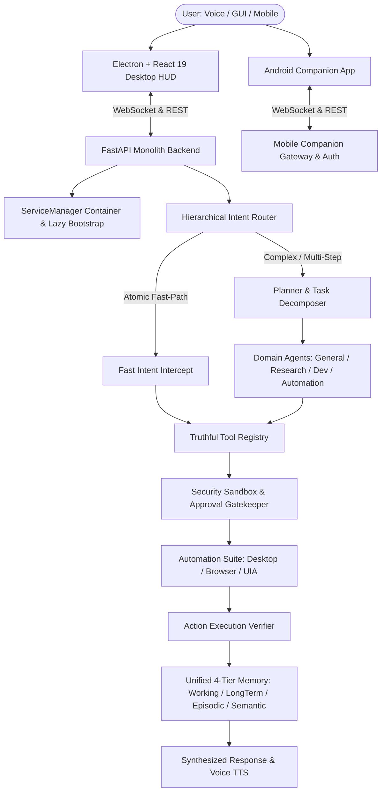

# 🏛️ ARCHITECTURE — JARVIS Personal AI Operating System

This document describes the runtime architecture, request lifecycles, memory structures, perception pipelines, and safety interlocks of the **JARVIS Personal AI OS**.

---

## 📐 System High-Level Architecture



---

## 🧩 Core Architectural Subsystems

### 1. ServiceManager Container & Lazy Bootstrap (`backend/services/manager.py`, `bootstrap.py`)
- **Lifecycle & Dependency Injection**: Central thread-safe container (`_lock = threading.RLock()`) supporting service registration (`register_instance`), factory registration (`register_factory`), and on-demand lazy instantiation via `get_instance(name)` and `get(name)`.
- **Lightweight Lifespan**: `main.py` eagerly boots only fail-closed core essentials (Config, EventBus, ContextManager, TaskQueue, Security Core, FastIntentRouter). 46 heavy and optional services are registered as on-demand lazy factories, eliminating startup bloat and cold-boot hangs.
- **Circular Dependency Protection & Diagnostics**: Thread-local dependency stack detection raises `CircularDependencyError` on cyclical resolutions. Reverse-initialization graceful shutdown in `shutdown_all()`.

### 2. Multi-Provider LLM Cascade & Streaming (`backend/services/llm/`)
- **Modular Provider Architecture**: Unified manager (`backend/services/llm/manager.py`) with dynamic routing across Ollama (Local), Google Gemini, Groq, OpenRouter, and OpenAI.
- **Circuit Breaker & Health Tracking**: Tracks provider availability with automatic cooldown timers and fallback cascading.
- **Unified Tool Calling & Streaming**: Standardized tool schemas (`tool_calling.py`) and token stream filters (`streaming.py`) across all providers.

### 3. Hierarchical Intent Routing & Fast Paths (`backend/agents/router.py`, `fast_intent_router.py`)
- **Hierarchical Categorization**: Classifies natural language requests across `CONVERSATION`, `KNOWLEDGE`, `ACTION`, `LIVE_PERCEPTION`, `RESEARCH`, `WORKFLOW`, `SYSTEM`, and `MULTI_STEP_TASK`.
- **Sub-Millisecond Deterministic Intercepts**: Atomic commands (`lock_pc`, `take_screenshot`, `open_application`, `media_control`, `get_system_status`) bypass LLM planning and route directly to `ToolRegistry` with safety validation.

### 4. Planner & 4 Strong Domain Agents (`backend/agents/planner/`, `backend/agents/domain/`)
- **Modular Planner Package (`backend/agents/planner/`)**:
  - `planner.py`: End-to-end task coordinator and execution loop.
  - `task_decomposer.py`: Multi-step goal analysis and fast-path intent matching.
  - `plan_validator.py`: Pre-execution validation, tool schema checks, and parameter verification.
  - `execution_plan.py`: Step-by-step progress tracking with real-time WebSocket state streaming.
- **Domain-Specialized Agents (`backend/agents/domain/`)**:
  - `GeneralAgent`: Conversational reasoning, persona formatting, system controls, and note-taking.
  - `ResearchAgent`: Web search, URL content extraction, PubChem chemoinformatics, and vector RAG retrieval.
  - `DeveloperAgent`: AST docstring generation, project scanning, text-to-SQL generation, and sandbox security checks.
  - `AutomationAgent`: Win32 UIA accessibility, desktop RPA macros, screen OCR, and Playwright browser navigation.

### 5. Unified 4-Tier Memory System (`backend/services/memory/`)
- **Working Memory (`working_memory.py`)**: Bounded sliding-window turn buffer (evicts oldest turns), ephemeral session cache, SQLite conversation history, and silent language tracking (`data/user_habits.json`).
- **Long-Term Memory (`long_term_memory.py`)**: Facts, preferences (ChromaDB `knowledge` + SQLite `MemoryLog` / `UserPreference`), NetworkX knowledge graph relationships (`data/memory/knowledge_graph.json`), command logs, and LLM consolidation.
- **Episodic Memory (`episodic_memory.py`)**: High-fidelity task execution traces (SQLite WAL `data/experiences.db`), procedural strategy confidence rankings (`data/strategy_memory.json`), lessons learned, and reusable workflows.
- **Semantic Memory (`semantic_memory.py`)**: Multi-format document ingestion (PDF, DOCX, PPTX, code, text), citations, and ChromaDB `rag_documents` vector search with fallback TF-IDF.

### 6. Consolidated Automation Architecture (`backend/services/automation/`)
- **Desktop Executor (`desktop_executor.py`)**: Native Win32 API, PyAutoGUI, process launching, window layout presets ('left', 'right', 'maximize'), keyboard/mouse primitives, volume/media control, and clipboard management.
- **Browser Executor (`browser_executor.py`)**: Playwright Chromium automation, multi-tab coordination, input/click interaction, page summarization, autonomous web agent loop (perceive-decide-act-observe), and deep research.
- **UIA Perception Engine (`uia_perception.py`)**: Win32 EnumChildWindows + PyWinAuto UIA control tree inspection, cascading control click (Win32 -> UIA Scene Graph -> OCR Visual Bounds -> Scroll Fallback), and perception-targeted typing.
- **Action Execution Verifier (`verifier.py`)**: Pre- and post-action outcome verification (process status via psutil/WorldModel, window foreground validation, and alternative shell recovery).
- **Automation Orchestrator (`orchestrator.py`)**: Multi-step macro recording & playback with persistent JSON workflow storage, RPA sequence executor (`execute_rpa_macro`), and unified sub-executor routing.

### 7. Multi-Tier Voice & Speech Intelligence (`backend/services/voice/`)
- **Central Coordinator (`voice_manager.py`)**: Pipeline state machine (`AssistantState`), push-to-talk, self-voice echo suppression, intelligent barge-in, voice commands, and conversation memory persistence.
- **Speech-to-Text (`stt_manager.py`)**: Faster-Whisper local CTranslate2 engine with thread-safe lazy loading, streaming interim tokens, and hallucination suppression.
- **3-Tier Text-to-Speech (`tts_manager.py`)**:
  1. Primary Online: Microsoft Edge-TTS streaming neural voice.
  2. Secondary Local: Piper ONNX offline neural synthesizer.
  3. Tertiary Fail-Safe: Windows Native SAPI `SpVoice` / `SpFileStream` WAV synthesizer.
- **Wake Word Detection (`wake_word_manager.py`)**: OpenWakeWord ONNX engine with lazy loading, chunk evaluation, and standalone listener lifecycle.
- **Audio Device Management (`audio_device_manager.py`)**: Safe sounddevice queries, RMS volume calculation, and 5MB bounded PCM buffer management.

### 8. Desktop Perception & Live Mode (`backend/services/perception/`, `live_mode/`, `world_model.py`)
- **Differential UIA Scene Graph (`uia_scene_graph.py`)**: Keyed scene caching by `(hwnd, window_title, bounds)` with 2.5s TTL. Fast-bypasses recursive win32 DOM parsing on unchanged foreground windows.
- **Lazy & Throttled WorldModel (`world_model.py`)**: Deferred window traversal until explicit access. Throttled caching for multi-display topology (5.0s), audio sessions (5.0s), ping connectivity (30.0s), and clipboard inspections (2.0s).
- **Adaptive Perception Loop (`live_engine.py`)**: Adaptive backoff loop (0.5s active -> 2.5s static backoff). Zero LLM invocation during static observation.
- **Spatial Engine (`spatial_engine.py`)**: Multi-monitor desktop topology coordinate mapping across unequal resolutions and negative display offsets.

### 9. Truthful Tool Registry & Security Sandbox (`backend/services/tool_registry.py`, `security/`)
- **Truthful Execution**: 61 executable system tools. Explicit error normalization (`{"status": "error", "error": "Tool has no execution handler"}` when handlers are absent).
- **Parameter Validation & Masking**: Schema validation for required fields, synchronous offloading via `asyncio.to_thread()`, and sensitive argument masking for audit logs.
- **Security Sandbox (`security/sandbox.py`)**: AST allowlist security gate permitting pure computational modules and rejecting forbidden calls (`eval`, `exec`, `os.system`, `subprocess`, dunder traversal).
- **Face Authentication (`face_auth_engine.py`)**: OpenCV Haar cascade ROI detection, 128-D spatial feature extraction, and Eye Aspect Ratio (EAR) blink liveness verification.

### 10. Client Interfaces & Mobile Bridge
- **Desktop UI**: Electron + React 19 + Tailwind CSS + Lucide Icons + Three.js HUD with lazy code splitting and responsive windowing.
- **Android Companion**: Native Android shell with WebView loading `companion.html`, WebSocket telemetry streaming, remote approval cards, and lockscreen coordination.
- **Mobile Bridge (`backend/services/mobile_bridge.py`)**: Fail-closed security approvals gatekeeper (`return False` on offline/timeout), JWT token authentication, and Telegram Bot fallback.

---

## 📂 Codebase Directory Layout

```
JARVIS/
├── backend/
│   ├── agents/                 # Planner, Intent Router, Domain Agents (General, Research, Dev, Automation)
│   │   ├── domain/             # Specialized domain agents
│   │   └── planner/            # Modular planner, task decomposer, plan validator, execution plan
│   ├── api/                    # REST routers (routes.py, mobile_router.py, debug_router.py, mobile_ws.py)
│   ├── models/                 # Pydantic schemas, database models, event envelopes
│   ├── prash/                  # Prash local Transformer engine, tokenizer & model architecture
│   ├── services/               # Core OS services
│   │   ├── automation/         # Consolidated automation (desktop, browser, uia, verifier, orchestrator)
│   │   ├── live_mode/          # Live Mode engine & Form Assistant
│   │   ├── llm/                # Multi-provider LLM manager, streaming, prompts, tool calling
│   │   ├── memory/             # Unified 4-tier memory (working, long_term, episodic, semantic)
│   │   ├── perception/         # UIA Scene Graph, Spatial Engine
│   │   ├── security/           # Security Sandbox, Face Auth, Credential Vault
│   │   ├── skills/             # Modular skill plugins (research, ui, vision, productivity, multimodal)
│   │   ├── voice/              # Consolidated voice (voice_manager, stt, tts, wake_word, audio_device)
│   │   ├── bootstrap.py        # Modular core service bootstrapper & 46 lazy factories
│   │   ├── manager.py          # Unified ServiceManager DI container
│   │   ├── tool_registry.py    # Truthful Tool Registry (61 executable tools)
│   │   └── world_model.py      # Aggregated desktop state & throttled telemetry
│   ├── tests/                  # 12 Master test suites (116 passing tests, 100% pass rate)
│   ├── utils/                  # Logger (loguru), retry decorators, helpers
│   ├── config.py               # Pydantic Settings & environment configuration
│   └── main.py                 # FastAPI application lifespan & socket entrypoint
├── frontend/                   # Electron + React 19 desktop command center
├── mobile_app/                 # Android WebView companion app & React Native client
├── documentations/             # Extended system specs, PRD, and implementation guides
├── requirements.txt            # Harmonized production Python dependencies across 8 functional tiers
└── requirements-dev.txt        # Development, testing & linting dependencies
```

