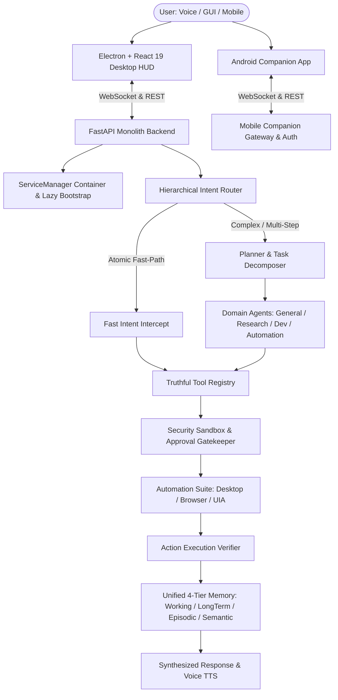
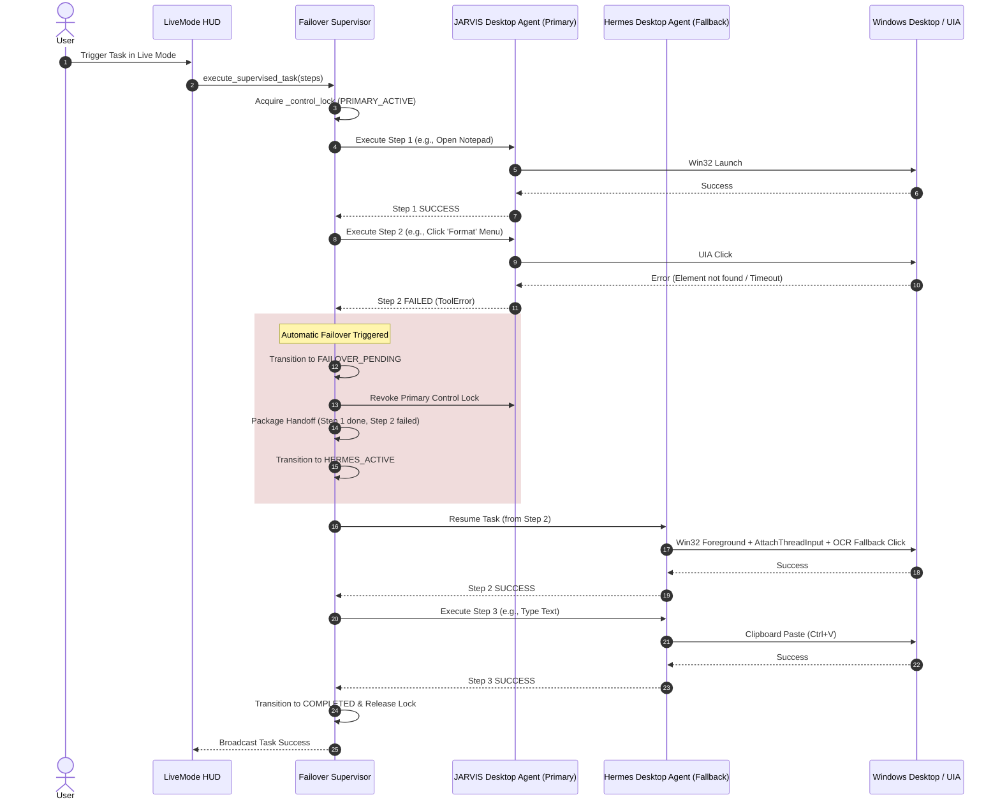

# 🏛️ ARCHITECTURE — JARVIS Personal AI Operating System

This document describes the runtime architecture, request lifecycles, memory structures, perception pipelines, and safety interlocks of the **JARVIS Personal AI OS**.

---

## 📐 System High-Level Architecture


```mermaid
graph TD
    User([User: Voice / GUI / Mobile]) --> DesktopClient[Electron + React 19 Desktop HUD]
    User --> MobileClient[Android Companion App]

    DesktopClient <-->|WebSocket & REST| FastAPI[FastAPI Monolith Backend]
    MobileClient <-->|WebSocket & REST| MobileGateway[Mobile Companion Gateway & Auth]

    FastAPI --> ServiceMgr[ServiceManager Container & Lazy Bootstrap]
    
    FastAPI --> IntentRouter[Hierarchical Intent Router]
    IntentRouter -->|Atomic Fast-Path| FastPath[Fast Intent Intercept]
    IntentRouter -->|Complex / Multi-Step| Planner[Planner & Task Decomposer]

    FastPath --> ToolReg[Truthful Tool Registry]
    Planner --> DomainAgents[Domain Agents: General / Research / Dev / Automation]
    DomainAgents --> ToolReg

    ToolReg --> SafetyGate[Security Sandbox & Approval Gatekeeper]
    SafetyGate --> AutomationExec[Automation Suite: Desktop / Browser / UIA]

    AutomationExec --> Verifier[Action Execution Verifier]
    Verifier --> Memory[Unified 4-Tier Memory: Working / LongTerm / Episodic / Semantic]
    Memory --> Response[Synthesized Response & Voice TTS]
```

---

## 🧩 Core Architectural Subsystems

### 1. ServiceManager Container & Lazy Bootstrap (`backend/services/manager.py`, `bootstrap.py`)
- **Lifecycle & Dependency Injection**: Central thread-safe container (`_lock = threading.RLock()`) supporting service registration (`register_instance`), factory registration (`register_factory`), and on-demand lazy instantiation via `get_instance(name)` and `get(name)`.
- **Lightweight Lifespan**: `main.py` eagerly boots only fail-closed core essentials (Config, EventBus, ContextManager, TaskQueue, Security Core, FastIntentRouter). 46 heavy and optional services are registered as on-demand lazy factories, eliminating startup bloat and cold-boot hangs.
- **Circular Dependency Protection & Diagnostics**: Thread-local dependency stack detection raises `CircularDependencyError` on cyclical resolutions. Reverse-initialization graceful shutdown in `shutdown_all()`.

### 2. Multi-Provider LLM Cascade & Streaming (`backend/services/llm/`)
- **Modular Provider Architecture**: Unified manager (`backend/services/llm/manager.py`) with dynamic routing across Ollama (Local), Google Gemini, Groq, OpenRouter, and OpenAI.
- **Circuit Breaker & Health Tracking**: Tracks provider availability with automatic cooldown timers and fallback cascading.
- **Unified Tool Calling & Streaming**: Standardized tool schemas (`tool_calling.py`) and token stream filters (`streaming.py`) across all providers.

### 3. Hierarchical Intent Routing & Fast Paths (`backend/agents/router.py`, `fast_intent_router.py`)
- **Hierarchical Categorization**: Classifies natural language requests across `CONVERSATION`, `KNOWLEDGE`, `ACTION`, `LIVE_PERCEPTION`, `RESEARCH`, `WORKFLOW`, `SYSTEM`, and `MULTI_STEP_TASK`.
- **Sub-Millisecond Deterministic Intercepts**: Atomic commands (`lock_pc`, `take_screenshot`, `open_application`, `media_control`, `get_system_status`) bypass LLM planning and route directly to `ToolRegistry` with safety validation.

### 4. Planner & 4 Strong Domain Agents (`backend/agents/planner/`, `backend/agents/domain/`)
- **Modular Planner Package (`backend/agents/planner/`)**:
  - `planner.py`: End-to-end task coordinator and execution loop.
  - `task_decomposer.py`: Multi-step goal analysis and fast-path intent matching.
  - `plan_validator.py`: Pre-execution validation, tool schema checks, and parameter verification.
  - `execution_plan.py`: Step-by-step progress tracking with real-time WebSocket state streaming.
- **Domain-Specialized Agents (`backend/agents/domain/`)**:
  - `GeneralAgent`: Conversational reasoning, persona formatting, system controls, and note-taking.
  - `ResearchAgent`: Web search, URL content extraction, PubChem chemoinformatics, and vector RAG retrieval.
  - `DeveloperAgent`: AST docstring generation, project scanning, text-to-SQL generation, and sandbox security checks.
  - `AutomationAgent`: Win32 UIA accessibility, desktop RPA macros, screen OCR, and Playwright browser navigation.

### 5. Unified 4-Tier Memory System (`backend/services/memory/`)
- **Working Memory (`working_memory.py`)**: Bounded sliding-window turn buffer (evicts oldest turns), ephemeral session cache, SQLite conversation history, and silent language tracking (`data/user_habits.json`).
- **Long-Term Memory (`long_term_memory.py`)**: Facts, preferences (ChromaDB `knowledge` + SQLite `MemoryLog` / `UserPreference`), NetworkX knowledge graph relationships (`data/memory/knowledge_graph.json`), command logs, and LLM consolidation.
- **Episodic Memory (`episodic_memory.py`)**: High-fidelity task execution traces (SQLite WAL `data/experiences.db`), procedural strategy confidence rankings (`data/strategy_memory.json`), lessons learned, and reusable workflows.
- **Semantic Memory (`semantic_memory.py`)**: Multi-format document ingestion (PDF, DOCX, PPTX, code, text), citations, and ChromaDB `rag_documents` vector search with fallback TF-IDF.

### 6. Consolidated Automation Architecture (`backend/services/automation/`)
- **Desktop Executor (`desktop_executor.py`)**: Native Win32 API, PyAutoGUI, process launching, window layout presets ('left', 'right', 'maximize'), keyboard/mouse primitives, volume/media control, and clipboard management.
- **Browser Executor (`browser_executor.py`)**: Playwright Chromium automation, multi-tab coordination, input/click interaction, page summarization, autonomous web agent loop (perceive-decide-act-observe), and deep research.
- **UIA Perception Engine (`uia_perception.py`)**: Win32 EnumChildWindows + PyWinAuto UIA control tree inspection, cascading control click (Win32 -> UIA Scene Graph -> OCR Visual Bounds -> Scroll Fallback), and perception-targeted typing.
- **Action Execution Verifier (`verifier.py`)**: Pre- and post-action outcome verification (process status via psutil/WorldModel, window foreground validation, and alternative shell recovery).
- **Automation Orchestrator (`orchestrator.py`)**: Multi-step macro recording & playback with persistent JSON workflow storage, RPA sequence executor (`execute_rpa_macro`), and unified sub-executor routing.

### 7. Multi-Tier Voice & Speech Intelligence (`backend/services/voice/`)
- **Central Coordinator (`voice_manager.py`)**: Pipeline state machine (`AssistantState`), push-to-talk, self-voice echo suppression, intelligent barge-in, voice commands, and conversation memory persistence.
- **Speech-to-Text (`stt_manager.py`)**: Faster-Whisper local CTranslate2 engine with thread-safe lazy loading, streaming interim tokens, and hallucination suppression.
- **3-Tier Text-to-Speech (`tts_manager.py`)**:
  1. Primary Online: Microsoft Edge-TTS streaming neural voice.
  2. Secondary Local: Piper ONNX offline neural synthesizer.
  3. Tertiary Fail-Safe: Windows Native SAPI `SpVoice` / `SpFileStream` WAV synthesizer.
- **Wake Word Detection (`wake_word_manager.py`)**: OpenWakeWord ONNX engine with lazy loading, chunk evaluation, and standalone listener lifecycle.
- **Audio Device Management (`audio_device_manager.py`)**: Safe sounddevice queries, RMS volume calculation, and 5MB bounded PCM buffer management.

### 8. Desktop Perception & Live Mode (`backend/services/perception/`, `live_mode/`, `world_model.py`)
- **Differential UIA Scene Graph (`uia_scene_graph.py`)**: Keyed scene caching by `(hwnd, window_title, bounds)` with 2.5s TTL. Fast-bypasses recursive win32 DOM parsing on unchanged foreground windows.
- **Lazy & Throttled WorldModel (`world_model.py`)**: Deferred window traversal until explicit access. Throttled caching for multi-display topology (5.0s), audio sessions (5.0s), ping connectivity (30.0s), and clipboard inspections (2.0s).
- **Adaptive Perception Loop (`live_engine.py`)**: Adaptive backoff loop (0.5s active -> 2.5s static backoff). Zero LLM invocation during static observation.
- **Spatial Engine (`spatial_engine.py`)**: Multi-monitor desktop topology coordinate mapping across unequal resolutions and negative display offsets.

### 9. Live Mode Failover Supervisor & Control Authority (`backend/services/live_mode/failover_controller.py`)
- **Single-Agent Control Lock (`_control_lock`)**: An `asyncio.Lock()` enforces single-agent control locking, preventing race conditions or simultaneous inputs between the primary JARVIS Desktop Agent and Hermes.
- **Authority Lifecycle**:
  - `PRIMARY_ACTIVE`: JARVIS Desktop Agent has sole execution authority.
  - `FAILOVER_PENDING`: An execution failure or timeout occurred; supervisor compiles the handoff payload.
  - `HERMES_ACTIVE`: Control lock transferred to Hermes Desktop Agent to resume from failure point.
  - `RECOVERY`: Recovery operations executing to restore normal state.
  - `COMPLETED` / `FAILED` / `CANCELLED`: Terminal status with lock release.
- **Dynamic Step Tracking**: Every step tracks `PENDING` ➔ `RUNNING` ➔ `SUCCESS` / `FAILED` / `TIMEOUT` / `BLOCKED`.
- **Seamless Failure Point Resume**: Primary sends `completed_steps`, `failed_step`, `error_reason`, and `screen_context`. Hermes skips completed steps and resumes execution directly.
- **Emergency Stop & Take Control**: `emergency_stop()` immediately cancels execution, clears state, and releases locks for user takeover.


```mermaid
sequenceDiagram
    autonumber
    actor User
    participant HUD as LiveMode HUD
    participant Sup as Failover Supervisor
    participant Pri as JARVIS Desktop Agent (Primary)
    participant Herm as Hermes Desktop Agent (Fallback)
    participant Win as Windows Desktop / UIA

    User->>HUD: Trigger Task in Live Mode
    HUD->>Sup: execute_supervised_task(steps)
    Sup->>Sup: Acquire _control_lock (PRIMARY_ACTIVE)
    Sup->>Pri: Execute Step 1 (e.g., Open Notepad)
    Pri->>Win: Win32 Launch
    Win-->>Pri: Success
    Pri-->>Sup: Step 1 SUCCESS
    Sup->>Pri: Execute Step 2 (e.g., Click 'Format' Menu)
    Pri->>Win: UIA Click
    Win-->>Pri: Error (Element not found / Timeout)
    Pri-->>Sup: Step 2 FAILED (ToolError)
    
    rect rgb(240, 220, 220)
        Note over Sup: Automatic Failover Triggered
        Sup->>Sup: Transition to FAILOVER_PENDING
        Sup->>Pri: Revoke Primary Control Lock
        Sup->>Sup: Package Handoff (Step 1 done, Step 2 failed)
        Sup->>Sup: Transition to HERMES_ACTIVE
    end

    Sup->>Herm: Resume Task (from Step 2)
    Herm->>Win: Win32 Foreground + AttachThreadInput + OCR Fallback Click
    Win-->>Herm: Success
    Herm-->>Sup: Step 2 SUCCESS
    Sup->>Herm: Execute Step 3 (e.g., Type Text)
    Herm->>Win: Clipboard Paste (Ctrl+V)
    Win-->>Herm: Success
    Herm-->>Sup: Step 3 SUCCESS
    Sup->>Sup: Transition to COMPLETED & Release Lock
    Sup-->>HUD: Broadcast Task Success
```

### 10. Hermes Bridge & Dual-Agent Execution Layer (`backend/services/hermes_bridge.py`, `backend/agents/`)
- **12-Pillar Bridge Architecture (`HermesBridgeService`)**:
  1. *Tool Execution*: Unified command/tool execution bridge.
  2. *Agent Orchestration*: Manages multi-agent lifecycles cleanly separated from core JARVIS.
  3. *Command Routing*: Routes intents to optimal executor (Primary vs. Fallback).
  4. *Computer Control Bridge*: Native OS API bridging with robust Win32 fallback.
  5. *Task Automation*: Autonomous multi-step sequence decomposition.
  6. *Background Tasks*: Detached async task queue (`hermes_async_task`).
  7. *Context Handling*: Context synchronization between JARVIS and Hermes.
  8. *Local Development*: Local-first CLI & daemon integration.
  9. *Extensibility*: Dynamic tool injection without modifying core brain.
  10. *Error Handling*: Automatic failure interception and recovery loops.
  11. *Permission Boundaries*: Full compatibility with JARVIS `SafetyGatekeeper`.
  12. *Status Streaming*: Real-time progress broadcasting over WebSocket.
- **Dual Hermes Agents**:
  - `HermesDesktopAgent` (`backend/agents/desktop_agent.py`): Windows 11 window foregrounding (`AttachThreadInput`), clipboard typing (`Ctrl+V`), and coordinate clicks.
  - `HermesGeneralAgent` (`backend/agents/hermes_agent.py`): Multi-step function calling orchestrator across all 69 JARVIS system tools.
  - `HermesOrchestrator` (`backend/agents/hermes_orchestrator.py`): Collaborative coordination and agent-to-agent delegation.

### 11. Chat Image Generation Engine (`backend/services/image_generator.py`)
- **Dual Engine Architecture**: Primary Google Imagen 3 with seamless automatic fallback to Pollinations AI.
- **Disk Caching & Static Hosting**: Persists generated images to `data/generated_images/` and serves via FastAPI static route `/generated_images/`.
- **Frontend Lightbox**: Chat panel embeds image preview cards with full-screen zoom, pan, copy, and download actions.

### 12. Truthful Tool Registry & Security Sandbox (`backend/services/tool_registry.py`, `security/`)
- **Truthful Execution**: 69 executable system tools. Explicit error normalization (`{"status": "error", "error": "Tool has no execution handler"}` when handlers are absent).
- **Parameter Validation & Masking**: Schema validation for required fields, synchronous offloading via `asyncio.to_thread()`, and sensitive argument masking for audit logs.
- **Security Sandbox (`security/sandbox.py`)**: AST allowlist security gate permitting pure computational modules and rejecting forbidden calls (`eval`, `exec`, `os.system`, `subprocess`, dunder traversal).
- **Face Authentication (`face_auth_engine.py`)**: OpenCV Haar cascade ROI detection, 128-D spatial feature extraction, and Eye Aspect Ratio (EAR) blink liveness verification.

### 13. Client Interfaces & Mobile Bridge
- **Desktop UI**: Electron + React 19 + Tailwind CSS + Lucide Icons + Three.js HUD with lazy code splitting, Live Mode Failover HUD banner, and Image Lightbox.
- **Android Companion App**: Dual-presentation Android client synchronized with JARVIS backend:
  - **Native React Native Client (`mobile_app/src/`)**: 6 ergonomic mobile tabs (`HUD`, `ACTIONS`, `CHAT`, `GATE`, `FILES`, `NETWORK`).
  - **Embedded Mission Control (`mobile_app/android/app/src/main/assets/companion.html`)**: 9 modular operational sub-panels (`Dashboard`, `Live Mode`, `Chat & Voice`, `Approvals`, `Screen & Apps`, `Tasks & Workflows`, `Files`, `Brain & Memory`, `Diagnostics`).
  - **Communication & Security**: WebSocket telemetry stream (`/api/v1/mobile/ws`), REST API with 8s bounded timeouts, zero hardcoded developer IPs, and Ed25519 cryptographic pairing.
  - **Biometric Approval Proof Model**: Zero trust client booleans or mock strings (`bio_sig_...`). High-risk actions generate backend unpredictable 32-byte single-use challenges bound to `(approval_id, action_type, dangerous_target, expires_at)`. Verified via Ed25519 asymmetric client signatures against registered device public keys with strict single-use consumption and replay protection.

### 14. Backward-Compatibility Facade Architecture
To prevent broken imports while keeping modular internal packages, JARVIS maintains zero-drift backward-compatibility facades that re-export from their canonical packages:
- `backend/agents/planner.py` ➔ `backend/agents/planner/planner.py`
- `backend/agents/message_router.py` ➔ `backend/agents/router.py`
- `backend/services/memory.py` ➔ `backend/services/memory/`
- `backend/services/automation.py` ➔ `backend/services/automation/desktop_executor.py`
- `backend/services/desktop_automation.py` ➔ `backend/services/automation/orchestrator.py`
- `backend/services/action_verifier.py` ➔ `backend/services/automation/verifier.py`
- `backend/services/uia_engine.py` ➔ `backend/services/automation/uia_perception.py`
- `backend/services/browser.py` ➔ `backend/services/automation/browser_executor.py`
- `backend/agents/voice.py` ➔ `backend/services/voice/voice_manager.py`
- `backend/services/stt.py` ➔ `backend/services/voice/stt_manager.py`
- `backend/services/tts.py` ➔ `backend/services/voice/tts_manager.py`
- `backend/services/wake_word.py` ➔ `backend/services/voice/wake_word_manager.py`
- `backend/services/voice_intelligence.py` ➔ `backend/services/voice/intelligence.py`

---

### 12. Canonical Security Hierarchy & Fail-Closed Precedence
JARVIS enforces one authoritative, fail-closed security hierarchy where no lower-level component or client approval can override a higher-level security denial:

```text
User Request
    ↓
Intent Classification (FastIntentRouter / RequestRouter)
    ↓
Planner / Decomposition (PlannerAgent / TaskDecomposer)
    ↓
SecurityPolicy & Out-of-Model Gatekeeper (SafetyGatekeeper / ASTSandbox / RBAC)
    ↓
Approval / Interactive Gatekeeper (MobileGatewayService / MobileBridgeService / FCM)
    ↓
ToolRegistry (Schema & Parameter Validation)
    ↓
Executor (DesktopExecutor / BrowserExecutor / SafeActionExecutor)
    ↓
ActionVerifier (ActionExecutionVerifier)
    ↓
Result
```

- **Inviolable Precedence Rules**:
  1. `Policy.DENY` + `Approval.ALLOW` = `DENY` (Security policy is inviolable).
  2. Unhandled security exceptions or missing services = `FAIL CLOSED (DENY)`.
  3. Client-side booleans (`biometric_authenticated = true`) without valid cryptographic signatures cannot authorize high-risk operations.
  4. Approvals are cryptographically bound to `(device_id, approval_id, action_type, dangerous_target, challenge_nonce)` with single-use nonce consumption and 30-60s TTL.

### 13. Mobile Endpoint Authorization Matrix

| Endpoint | Path | Public | Authenticated | Paired Device | Sensitive Approval |
| :--- | :--- | :---: | :---: | :---: | :---: |
| **Pairing Initiation** | `POST /api/v1/mobile/pair/initiate` | ✅ Yes | ❌ No | ❌ No | ❌ No |
| **QR Code Generation** | `GET /api/v1/mobile/pair/qr/generate` | ✅ Yes | ❌ No | ❌ No | ❌ No |
| **QR Code Scan Confirmation** | `POST /api/v1/mobile/pair/qr/scan` | ✅ Yes | ❌ No | ❌ No | ❌ No |
| **Pairing PIN Confirmation** | `POST /api/v1/mobile/pair/confirm` | ✅ Yes | ❌ No | ❌ No | ❌ No |
| **Pairing Status Check** | `GET /api/v1/mobile/pair/status/{session_id}` | ✅ Yes | ❌ No | ❌ No | ❌ No |
| **Device Revocation** | `POST /api/v1/mobile/devices/{device_id}/revoke` | ❌ No | ✅ JWT | ✅ Yes | ❌ No |
| **Device Unpair** | `DELETE /api/v1/mobile/devices/{device_id}` | ❌ No | ✅ JWT | ✅ Yes | ❌ No |
| **List Trusted Devices** | `GET /api/v1/mobile/devices` | ❌ No | ✅ JWT | ✅ Yes | ❌ No |
| **Telemetry HUD Stream** | `GET /api/v1/mobile/telemetry` | ❌ No (Discovery only) | ❌ No | ❌ No | ❌ No |
| **Desktop Commands** | `POST /api/v1/mobile/system/command` | ❌ No | ✅ JWT | ✅ Yes | ✅ Gatekeeper Intercept |
| **Approval Decision** | `POST /api/v1/mobile/approvals/{id}/decision` | ❌ No | ✅ JWT | ✅ Yes | ✅ Ed25519 Signature |
| **Filesystem Operations** | `GET/POST /api/v1/mobile/files/*` | ❌ No | ✅ JWT | ✅ Yes | ✅ Workspace Sandboxed |
| **Live Mode Stream** | `GET /api/v1/mobile/live_mode/status` | ❌ No | ✅ JWT | ✅ Yes | ❌ No |

---

## 📂 Codebase Directory Layout

```
JARVIS/
├── backend/
│   ├── agents/                 # Planner, Intent Router, Domain Agents (General, Research, Dev, Automation)
│   │   ├── domain/             # Specialized domain agents
│   │   └── planner/            # Modular planner, task decomposer, plan validator, execution plan
│   ├── api/                    # REST routers (routes.py, mobile_router.py, debug_router.py, mobile_ws.py)
│   ├── models/                 # Pydantic schemas, database models, event envelopes
│   ├── prash/                  # Prash local Transformer engine, tokenizer & model architecture
│   ├── services/               # Core OS services
│   │   ├── automation/         # Consolidated automation (desktop, browser, uia, verifier, orchestrator)
│   │   ├── live_mode/          # Live Mode engine & Form Assistant
│   │   ├── llm/                # Multi-provider LLM manager, streaming, prompts, tool calling
│   │   ├── memory/             # Unified 4-tier memory (working, long_term, episodic, semantic)
│   │   ├── perception/         # UIA Scene Graph, Spatial Engine
│   │   ├── security/           # Security Sandbox, Face Auth, Credential Vault
│   │   ├── skills/             # Modular skill plugins (research, ui, vision, productivity, multimodal)
│   │   ├── voice/              # Consolidated voice (voice_manager, stt, tts, wake_word, audio_device)
│   │   ├── bootstrap.py        # Modular core service bootstrapper & 46 lazy factories
│   │   ├── manager.py          # Unified ServiceManager DI container
│   │   ├── tool_registry.py    # Truthful Tool Registry (61 executable tools)
│   │   └── world_model.py      # Aggregated desktop state & throttled telemetry
│   ├── tests/                  # 16 Master test suites (149 passing tests, 100% pass rate)
│   ├── utils/                  # Logger (loguru), retry decorators, helpers
│   ├── config.py               # Pydantic Settings & environment configuration
│   └── main.py                 # FastAPI application lifespan & socket entrypoint
├── frontend/                   # Electron + React 19 desktop command center
├── mobile_app/                 # Android WebView companion app & React Native client
├── documentations/             # Extended system specs, PRD, and implementation guides
├── requirements.txt            # Harmonized production Python dependencies across 8 functional tiers
└── requirements-dev.txt        # Development, testing & linting dependencies
```


