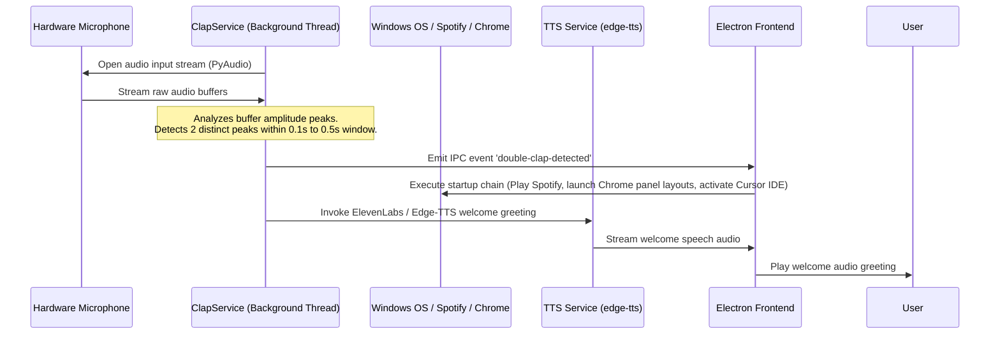
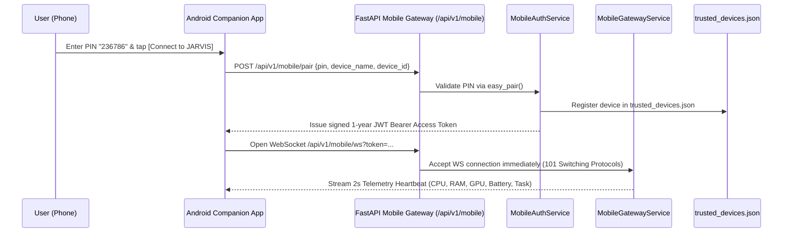
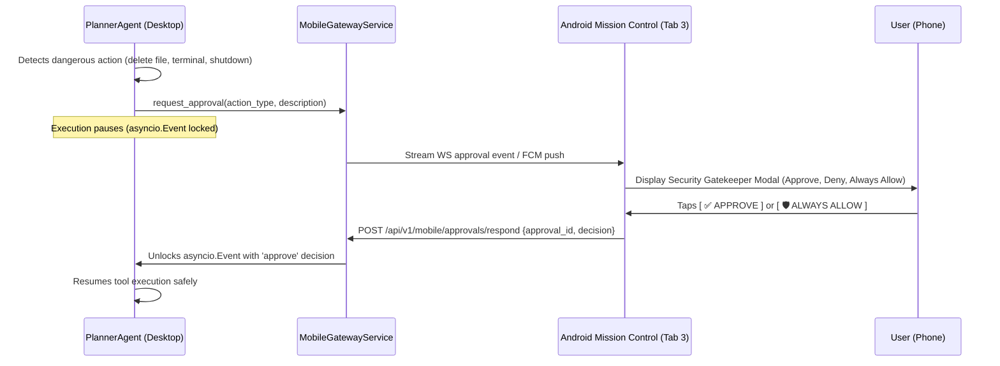
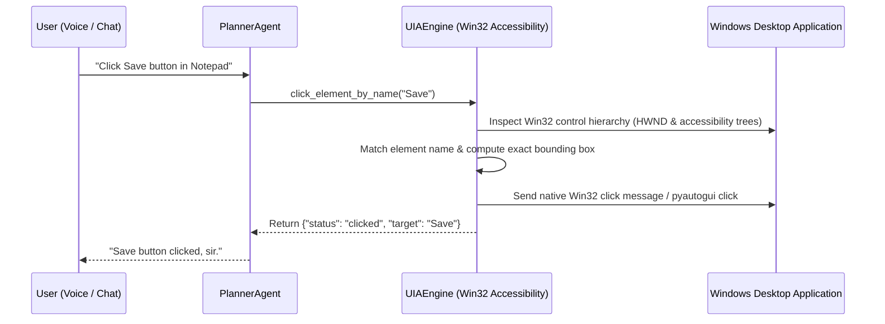
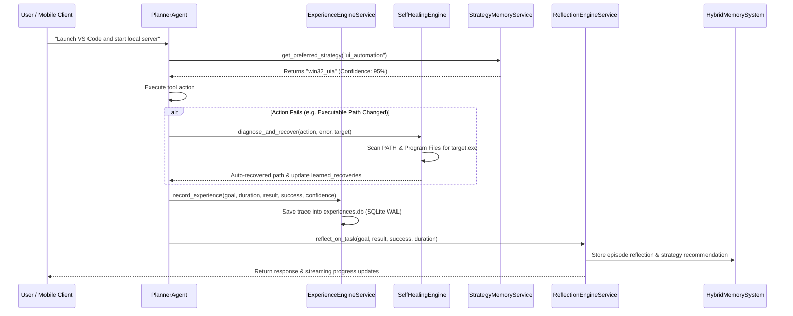

# 🔄 Application Flow & Execution Sequences

This document maps out the operational lifecycles, message-passing flows, state machines, and mobile companion interactions within the JARVIS personal AI OS ecosystem. **Last Updated:** July 23, 2026

---

## 1. Workstation Initialize Flow (Double-Clap Trigger)

The `ClapService` listens continuously in the background using a lightweight audio thread. It detects physical claps by looking for high peak-to-average power ratios (PAPR) and triggers automated setup tasks without waking up the LLM speech loop.

---

## 2. Dedicated Android Mobile Companion Pairing & Gatekeeper Flow

---

## 3. Mobile Security Approval Gatekeeper Intercept Flow

---

## 4. Native Windows UI Automation (UIA) Execution Flow

---

## 5. Self-Improving Action Trace, Reflection & Fault Recovery Sequence

