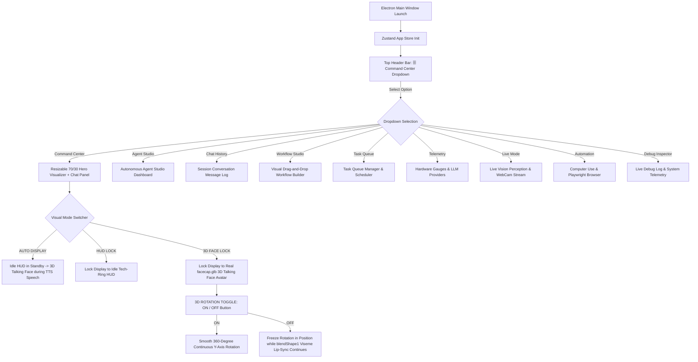
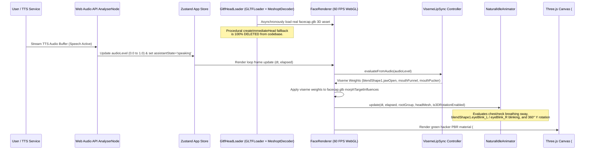
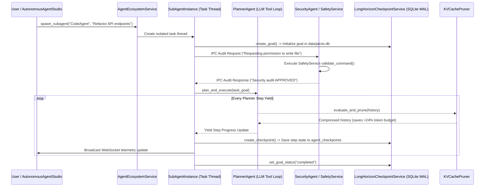
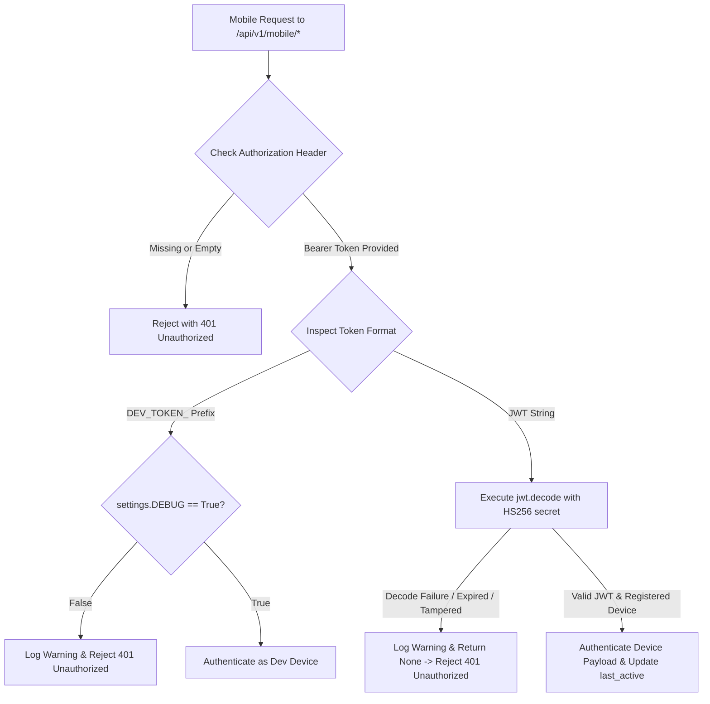

# 🔄 Application Flow & Execution Sequences

This document maps out the operational lifecycles, message-passing flows, state machines, and visual navigation interactions within the JARVIS personal AI OS ecosystem. **Last Updated:** July 31, 2026

---

## 1. Unified Navigation & Mode Switcher Flow

The top header bar consolidates all navigation into a single dropdown menu (`☰ Command Center ▾`), while the main hero visualizer panel automatically transitions between the **Idle Tech-Ring Circular HUD** and the **`facecap.glb` 3D Talking Face Avatar** based on speech state or manual user lock.

---

## 2. Real `facecap.glb` 3D Face Engine Rendering & Viseme Speech Flow

---

## 3. Autonomous Agent Ecosystem & IPC Execution Flow

---

## 4. Fail-Closed Mobile Companion Security Authentication Flow

