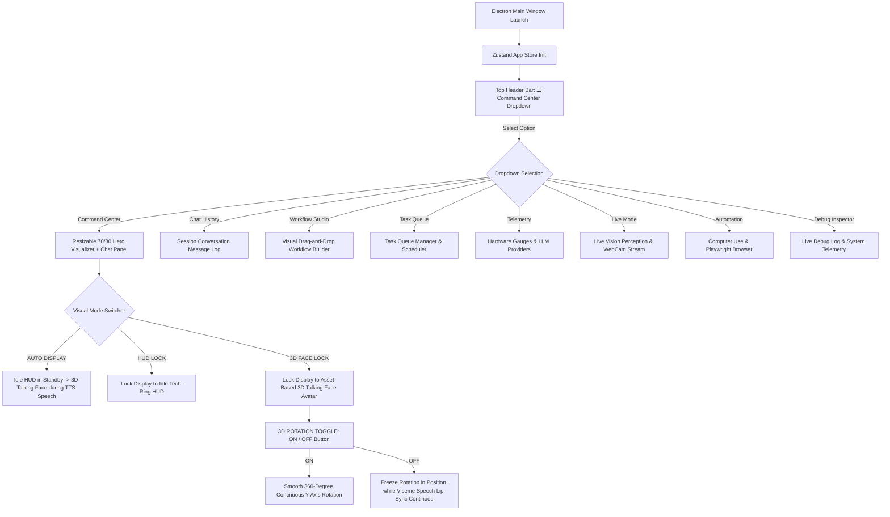
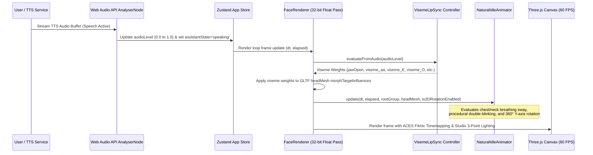
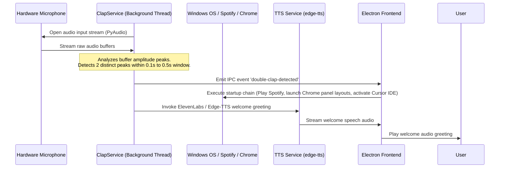
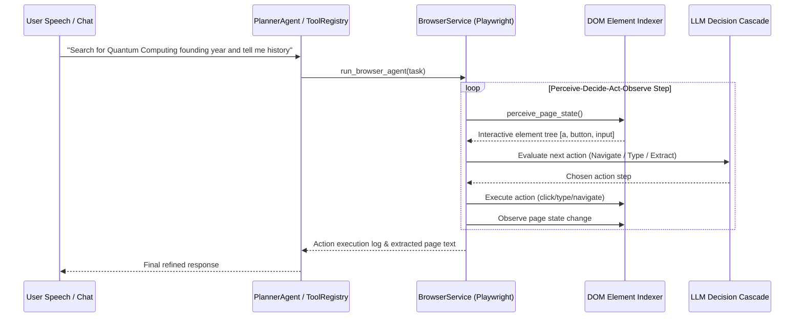
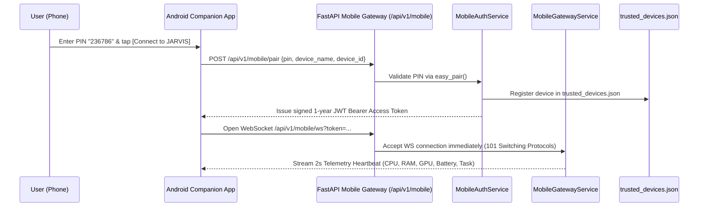

# 🔄 Application Flow & Execution Sequences

This document maps out the operational lifecycles, message-passing flows, state machines, and visual navigation interactions within the JARVIS personal AI OS ecosystem. **Last Updated:** July 29, 2026

---

## 1. Unified Navigation & Mode Switcher Flow

The top header bar consolidates all navigation into a single dropdown menu (`☰ Command Center ▾`), while the main hero visualizer panel automatically transitions between the **Idle Tech-Ring Circular HUD** and the **Asset-Based 3D Talking Face Avatar** based on speech state or manual user lock.

---

## 2. 3D Face Engine Rendering & Viseme Speech Flow

---

## 3. Workstation Initialize Flow (Double-Clap Trigger)

The `ClapService` listens continuously in the background using a lightweight audio thread. It detects physical claps by looking for high peak-to-average power ratios (PAPR) and triggers automated setup tasks without waking up the LLM speech loop.

---

## 4. Autonomous Web Agent Interaction Sequence Flow

---

## 5. Dedicated Android Mobile Companion Pairing & Gatekeeper Flow

