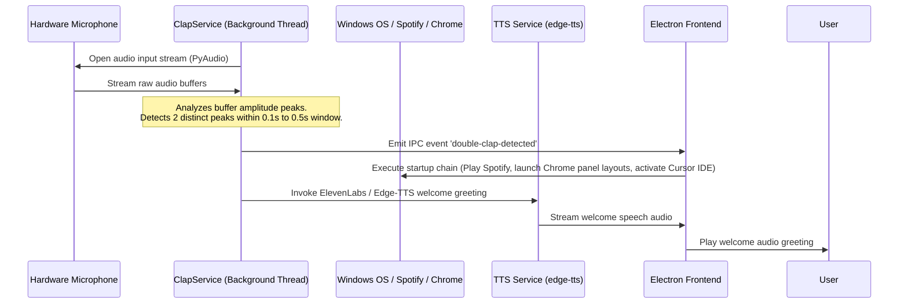
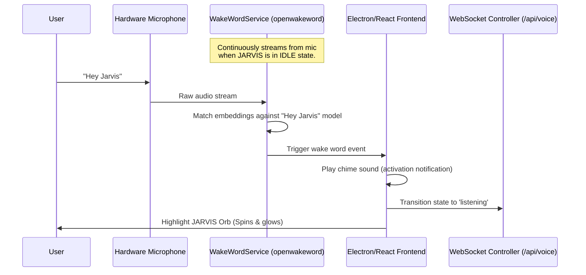
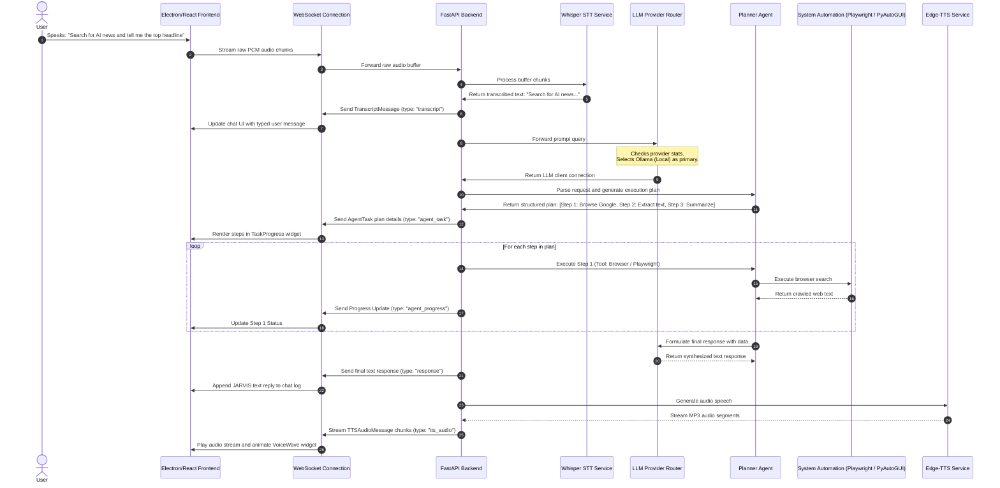
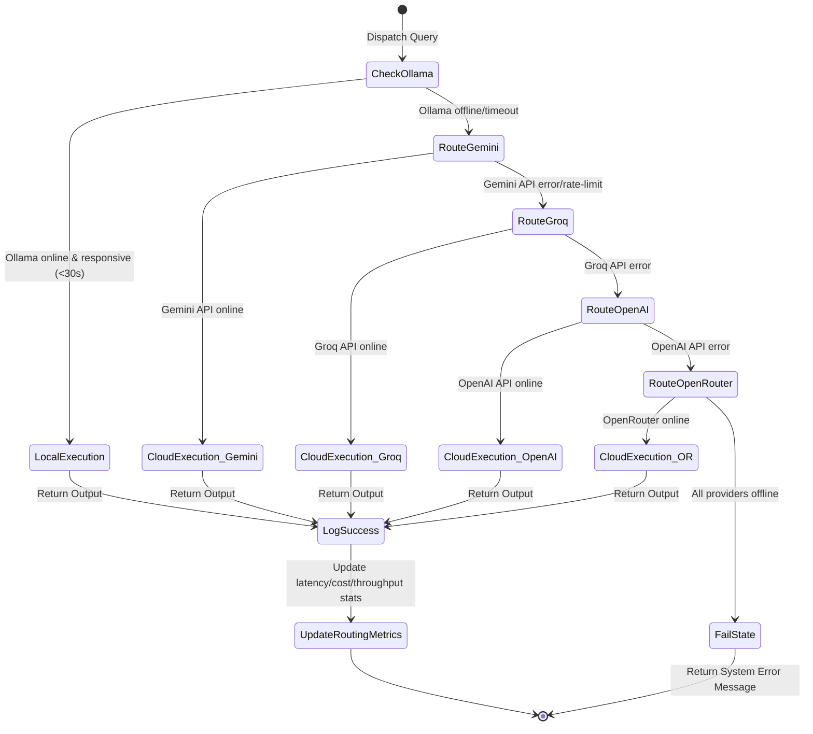
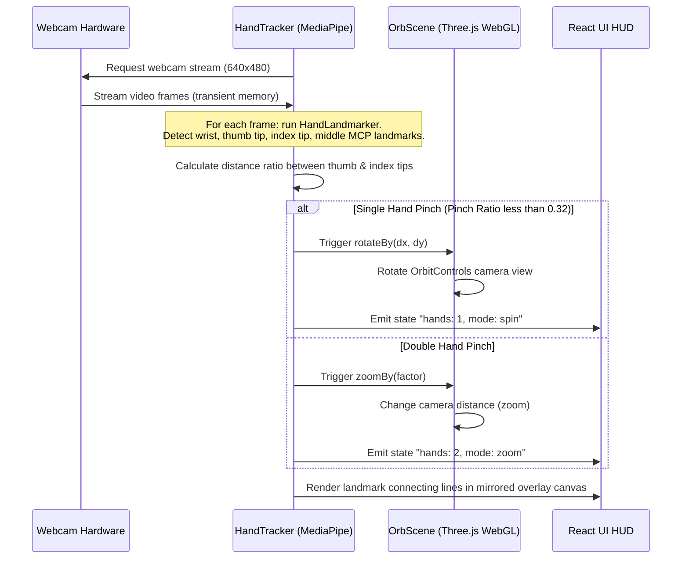

# 🔄 Application Flow & Execution Sequences

This document maps out the operational lifecycles, message-passing flows, and state machines within the JARVIS desktop ecosystem.

---

## 1. Workstation Initialize Flow (Double-Clap Trigger)

The `ClapService` listens continuously in the background using a lightweight audio thread. It detects physical claps by looking for high peak-to-average power ratios (PAPR) and triggers automated setup tasks without waking up the LLM speech loop.

---

## 2. Wake Word Activation Flow

---

## 3. Voice Request & Execution Loop

This diagram details a complete multi-step task execution from voice input to subagent execution.

---

## 4. LLM Routing & Failover State Machine

When a query is dispatched, the `LLMRouter` checks the availability of Ollama. If it fails, it cascades through the cloud providers.

---

## 5. Main UI State Transitions

The JARVIS frontend Orb and VoiceWave widgets change state dynamically according to WebSocket status events:

1. **`idle`**: Default state. Central orb breathes slowly. Voice waves are flat. Wake word engine runs in background.
2. **`wake_word_detected`**: Triggered by local OpenWakeWord. Plays wake audio chime and pulses orb.
3. **`listening`**: Mic is active. Orb spins slowly; waveform displays active real-time input amplitude.
4. **`processing`**: LLM router is executing or Planner is building tasks. Orb glows intensely and rotates quickly; waveform displays computing loading pulses.
5. **`executing`**: Subagents are executing automation tools or shell commands. Orb transitions to an orange/amber color layout, spinning and pulsing; UI lists running task checkmarks.
6. **`speaking`**: TTS audio plays. Orb scales dynamically (core vibrates) in sync with audio amplitude levels.

---

## 6. Hand Gesture Control Flow

The local hand gesture processing pipelines map frames to 3D matrix manipulations:

