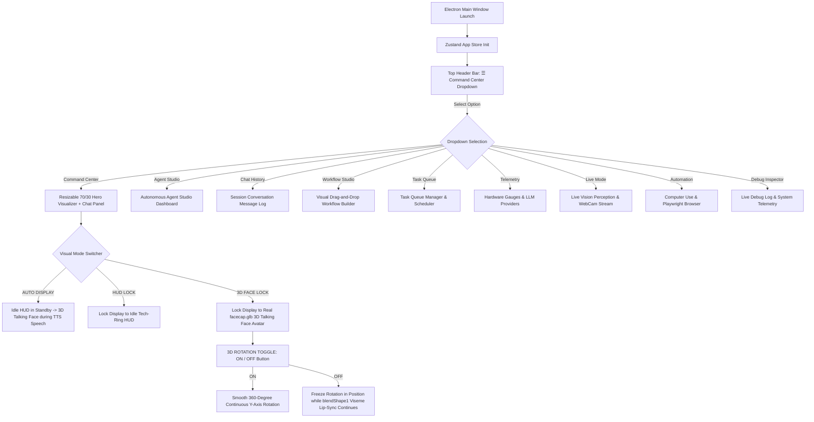
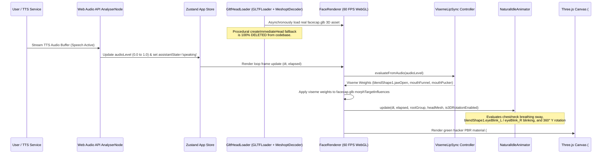
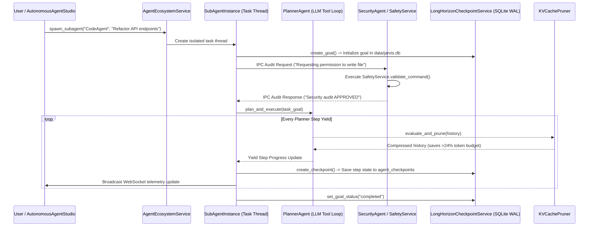
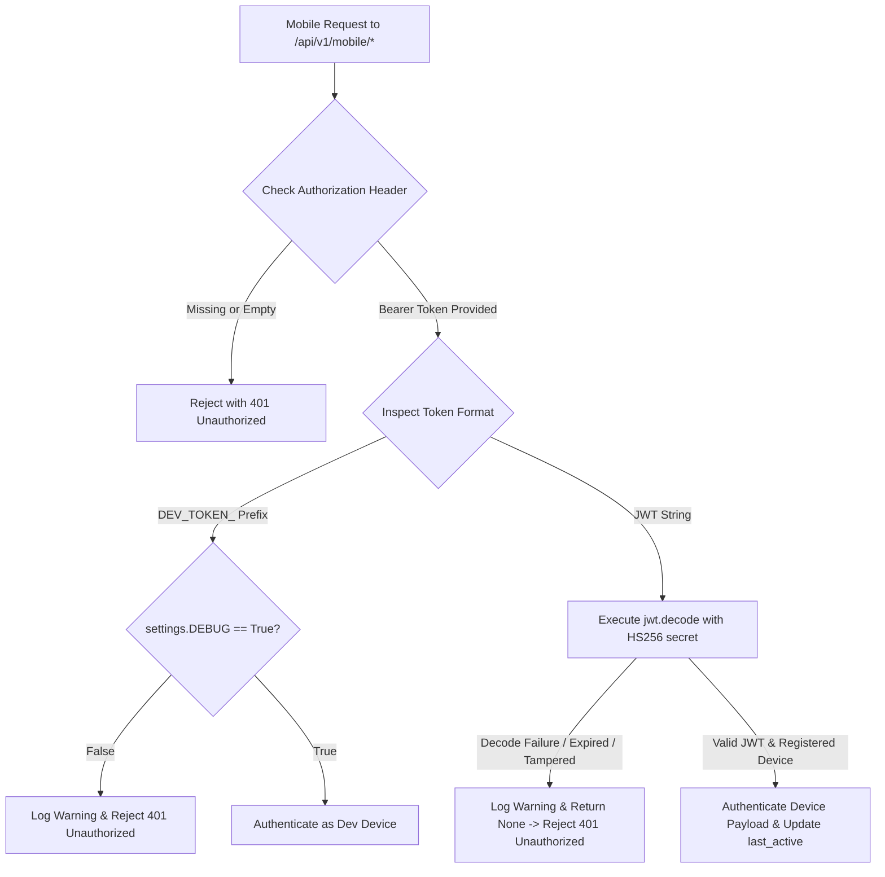
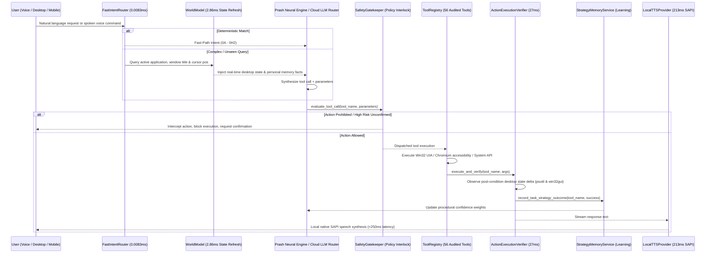
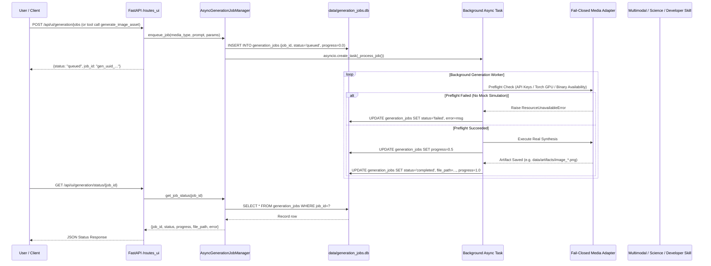

# 🔄 Application Flow & Execution Sequences

This document maps out the operational lifecycles, message-passing flows, state machines, and visual navigation interactions within the JARVIS personal AI OS ecosystem. **Last Updated:** August 8, 2026

---

## 1. Unified Navigation & Mode Switcher Flow

The top header bar consolidates all navigation into a single dropdown menu (`☰ Command Center ▾`), while the main hero visualizer panel automatically transitions between the **Idle Tech-Ring Circular HUD** and the **3D Arc Reactor system** based on speech state or manual user lock.

---

## 2. Real `facecap.glb` 3D Face Engine Rendering & Viseme Speech Flow

---

## 3. Autonomous Agent Ecosystem & IPC Execution Flow

---

## 4. Fail-Closed Mobile Companion Security Authentication Flow

---

## 5. Master Unified Decision, Actuation, Verification & Learning Lifecycle Flow

The complete closed-loop lifecycle connecting perception, decision, safety, execution, verification, and learning:

---

## 6. Asynchronous Multimodal Generation & Specialized Domain Flow (Added September 8, 2026)

