# 🛠️ Technical Specification — JARVIS Architecture & Technologies

## 1. System Overview

JARVIS is built as a split-architecture personal AI OS:
1. **Frontend Desktop (Presentation Layer)**: An Electron-based shell wrapping a React 19 application with a 3D WebGL Arc Reactor Orb, Visual Workflow Studio, and Task Queue Manager.
2. **Dedicated Mobile Companion App**: Native Android App wrapper ([`mobile_app/android/`](file:///c:/Users/ashri/JARVIS/mobile_app/android/)) hosting an 8-Tab Material 3 Dark-Theme Mission Control Dashboard ([`companion.html`](file:///c:/Users/ashri/JARVIS/mobile_app/android/app/src/main/assets/companion.html)) connecting via secure HTTPS REST API and WebSockets (`0.0.0.0:8000`).
3. **Backend Engine (Application & Intelligence Layer)**: A FastAPI application running locally bound to `0.0.0.0:8000`. It manages speech services, multi-provider LLM fallback routing, native Win32 accessibility UI automation, SQLite FTS5 file search, and mobile security gatekeeping.

```mermaid
graph TD
    User([User]) <-->|Voice/UI| Frontend[Electron + React UI]
    Phone([Android Phone]) <-->|REST & WS 8000| Backend[FastAPI Server - 0.0.0.0:8000]
    
    subgraph Backend Services
        Auth[MobileAuthService]
        Gate[MobileGatewayService]
        UIA[UIAEngine - Win32]
        FTS[FileIndexerService - FTS5]
        Router[LLM Router]
        Planner[PlannerAgent]
        MemoryService[Memory & Vector RAG]
        ExpEngine[ExperienceEngine]
        ReflEngine[ReflectionEngine]
        SelfHealing[SelfHealingEngine]
        StratMemory[StrategyMemoryService]
        LiveEngine[LiveModeEngine - 1.0 FPS Perception Loop]
        SceneGraph[UIASceneGraph - Win32 UIA Parser]
        SpatialEngine[SpatialEngine - Multi-Monitor Engine]
        FormAssistant[FormAssistant - Smart Form Parser]
        STT[Faster-Whisper STT]
        TTS[Edge-TTS Engine]
    end
    
    Backend <--> Auth
    Backend <--> Gate
    Backend <--> UIA
    Backend <--> LiveEngine
    Backend <--> SceneGraph
    Backend <--> SpatialEngine
    Backend <--> FormAssistant
    Backend <--> FTS
    Backend <--> Router
    Backend <--> STT
    Backend <--> TTS
    Backend <--> MemoryService
    Backend <--> ExpEngine
    Backend <--> ReflEngine
    Backend <--> SelfHealing
    Backend <--> StratMemory
    
    subgraph Databases
        SQLite[(SQLite WAL Mode)]
        Chroma[(ChromaDB Vector Store)]
    end
    
    MemoryService <--> SQLite
    MemoryService <--> Chroma
```

---

## 2. Technical Stack Details

### 2.1. Mobile Gateway & Android Mission Control
* **Mobile Router & WebSockets**: `mobile_router.py` & `mobile_ws.py` handling PIN pairing, device JWT authentication, live telemetry streaming, remote system commands (`shutdown`, `restart`, `lock`), screen preview thumbnails, and 8-tab Mission Control navigation.
* **Mobile Security Gatekeeper**: `MobileGatewayService` pausing dangerous desktop operations (`asyncio.Event`) until resolved via mobile push notification.
* **Android Shell Security**: Configured [`network_security_config.xml`](file:///c:/Users/ashri/JARVIS/mobile_app/android/app/src/main/res/xml/network_security_config.xml) and `setAllowUniversalAccessFromFileURLs(true)` in [`MainActivity.java`](file:///c:/Users/ashri/JARVIS/mobile_app/android/app/src/main/java/com/jarvis/companion/MainActivity.java#L28) allowing local cleartext HTTP/WebSocket connections on Wi-Fi network `0.0.0.0:8000`.

### 2.2. Desktop UI Automation & Natural Language File Indexing
* **Native Win32 Accessibility Automation**: `UIAEngine` wrapping Win32 accessibility controls to locate and interact with desktop applications resolution-independently.
* **Sub-second File Indexer**: `FileIndexerService` employing SQLite Full-Text Search (FTS5) virtual tables for searching local workspace files.

### 2.3. Database Concurrency & WebGL Battery Throttling
* **SQLite WAL Mode**: Enforced `PRAGMA journal_mode=WAL;` across all connections (`MemoryService`, `RAGService`, `FileIndexerService`).
* **WebGL Battery Saver**: `visibilitychange` listener in `Orb.tsx` pauses WebGL rendering loops when window is obscured or minimized.
