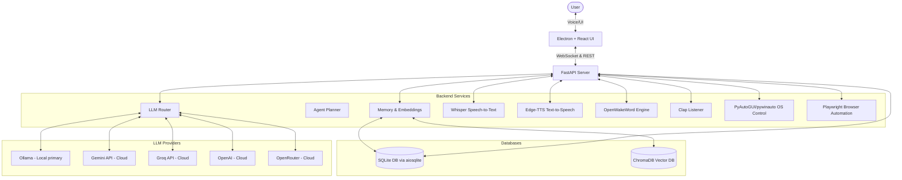
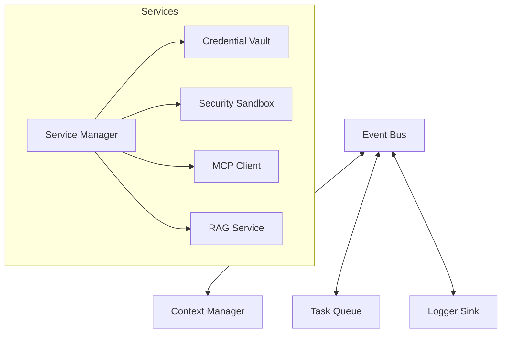

# 🛠️ Technical Specification — JARVIS Architecture & Technologies

## 1. System Overview

JARVIS is built as a split-architecture desktop application:
1. **Frontend (Presentation Layer)**: An Electron-based shell wrapping a React 19 application. It handles user inputs (keyboard, mouse, mic), displays real-time agent plans, transcripts, and status animations (Orb, VoiceWave).
2. **Backend (Application Layer)**: A Python FastAPI application that handles speech services (STT, TTS), audio queue management, LLM provider routing, planning, subagent orchestration, and hardware controls.
3. **Communication**: Real-time communication occurs over a local **WebSocket connection** (`/api/voice`) for duplex audio streaming and state synchronization, alongside standard **REST endpoints** for settings and history.

---

## 2. Technology Stack

| Layer | Component | Selected Technology | Rationale |
| :--- | :--- | :--- | :--- |
| **Frontend** | Shell Framework | Electron | Native Windows window creation, desktop shortcuts, IPC bindings, background window execution. |
| | Render Framework | React 19 | Highly reactive state binding, component lifecycle management. |
| | CSS Framework | Tailwind CSS 4 | Custom utility-first classes, modern variables, and fast compilation. |
| | State Management | Zustand | Lightweight, hooks-based global state container for audio streams and app states. |
| | 3D Graphics | Three.js | Real-time WebGL rendering engine for the cognitive 3D Orb visualizations and drift particles. |
| | Gesture Tracking | MediaPipe Tasks-Vision | Local machine learning hand landmark tracking for viewport rotation and zoom triggers. |
| **Backend** | API Engine | FastAPI + Uvicorn | High-performance asynchronous REST and WebSockets. |
| | Speech-to-Text | faster-whisper | Fast, local transformer model inference for audio transcription. |
| | Text-to-Speech | edge-tts | Free, extremely natural speech synthesis utilizing Microsoft Edge's translation services. |
| | Wake Word | openwakeword | Highly customizable local wake word engine with minimal CPU overhead. |
| | Sound Activator | PyAudio | Raw audio input analysis for clap pattern recognition (peaks and intervals). |
| | OS Automation | pywinauto + PyAutoGUI | Complete desktop orchestration, window focusing, mouse clicking, and keyboard shortcuts. |
| | Web Automation | Playwright (Python) | Robust, sandboxed chromium automation, scraping, and deep research actions. |
| | OCR Engine | Pytesseract | Local image-to-text decoding fallback. |
| **Database** | Relational Store | SQLAlchemy + aiosqlite | Asynchronous ORM and non-blocking SQLite database driver. |
| | Vector Database | ChromaDB | Local, lightweight vector storage for long-term semantic memories. |
| **Orchestrator**| Local LLM | Ollama (`qwen2.5-coder:3b`) | Free, offline, high-speed coding and tool-calling model. |
| | Cloud LLM Router| Google GenAI SDK, OpenAI, Groq | Multi-provider failover chains with automatic performance benchmarking. |

---

## 3. Authentication & Security (Local-First Design)

* **No Multi-Tenant Authentication**:
  * Since JARVIS runs locally as a Windows desktop application, there is no web auth (OAuth/JWT/Sessions) needed.
  * System security is tied directly to the Windows User Profile context.
* **Credential Storage**:
  * API Keys (Gemini, Groq, OpenAI, OpenRouter) are loaded strictly from a local `.env` file in the root directory.
  * The frontend accesses keys via secure Electron IPC channels; they are never exposed to external web environments.
* **Safety Sandbox**:
  * The `SafetyService` checks all incoming text prompts and planned CLI commands against a banned keywords dictionary.
  * System critical commands (e.g., system shutdown, deleting directories, file system overrides) prompt the user with a confirmation modal before execution.
* **Camera Access Privacy**:
  * The webcam feed used for hand tracking is processed strictly inside the local renderer process (browser sandbox).
  * Video streams, images, and landmark coordinates are handled entirely in transient memory and immediately discarded. No video data is ever saved to the local file system or uploaded to external cloud endpoints.
* **Vault Encryption**:
  * API Keys and secrets are stored in a dedicated `CredentialVault` using Windows Credential Locker.
  * Local fallback stores keys in `data/security/vault.bin` utilizing AES-256 Fernet ciphers.
* **Execution Sandbox**:
  * Standard python and terminal scripts are run inside a resource-constrained, timeout-locked (15s) subprocess.
  * Filters and strips environment variables to prevent API token leakage.
  * Destructive commands are blocked by regex filters and prompt for manual approval.

---

## 4. Next-Generation Architecture & Services

The application core has been refactored into a decoupled, event-driven service layout:

### 4.1. Event Bus (`event_bus.py`)
* **Topic-Based Routing**: Asynchronous, thread-safe message broker supporting wildcard pattern subscriptions (`*`).
* **Core Topics**:
  * `system.status_changed`: Fired during voice and agent state changes.
  * `context.updated.*`: Context variables update triggers.
  * `task.*`: Task queue job state updates.
  * `log.new`: Loguru streams broadcast to listeners.
  * `agent.message`: Multi-agent messaging transactions.

### 4.2. Secure Sandbox & Vault (`vault.py`, `sandbox.py`, `rbac.py`)
* **Subprocess Constraint**: Runs Python code asynchronously using python executable subprocesses, filtering critical system context and checking execution outputs.
* **RBAC & Confirmations**: Defines Admin/User/Guest roles, blocks unauthorized files/systems actions, and writes persistent JSON entry lines to `data/security/audit.log`.

### 4.3. Model Context Protocol (`client.py`, `file_server.py`)
* **Stdin/Stdout Channels**: Spawns local python subprocess servers, exchanging JSON-RPC 2.0 requests over standard pipes.
* **MCPClientManager**: Discover tools via `tools/list` on launch and route actions through `tools/call`.

### 4.4. Hierarchical Agents (`orchestrator.py`)
* **CEO-Planner-Worker Loop**:
  * CEO receives user objectives, coordinates event cycles, and responds.
  * Planner generates sequential execution tasks.
  * Worker agents (Desktop, Browser, Coding, Research, File) run individual task steps.

### 4.5. Hybrid Memory System (`hybrid_memory_system.py`)
* **Six Memory Dimensions**:
  * **Working**: Active session states.
  * **Conversational**: Chat transcript lists.
  * **Semantic**: Keyword lookups.
  * **Procedural**: Pre-mapped workflow plans.
  * **Episodic**: Serialized history traces in SQLite/JSON files.
  * **Knowledge Graph**: Relationship networks modeled using `NetworkX` and persisted to `data/memory/knowledge_graph.json`.

### 4.6. Incremental RAG Service (`rag_service.py`)
* **Native docx/pptx Parser**: ZIP-opens OpenXML packages and parses XML paragraphs/slides natively.
* **Index Manifest**: Checks file modification timestamps (`os.path.getmtime`) inside `index_manifest.json` to skip re-indexing unchanged documents.
* **ChromaDB / TF-IDF Search**: Performs embedding vector search queries, falling back to local cosine TF-IDF dictionary queries.

---

## 5. Database Setup & Configurations

The SQLite database (`data/jarvis.db`) is managed asynchronously:
* **Engine**: Async SQLAlchemy engine: `sqlite+aiosqlite:///data/jarvis.db`.
* **Pooling**: Concurrency pre-ping to ensure active connection validation: `pool_pre_ping=True`.
* **Lifecycle**: Initialized on FastAPI startup (`init_db`) and gracefully disposed on shutdown (`close_db`).
* **Semantic Storage**: ChromaDB is stored under `data/chroma`. Semantic memory chunks are embedded and queried locally using basic sentence-transformers or cloud-based embedding fallbacks.

---

## 6. API Endpoints

### 5.1. WebSocket Endpoints
* **`WS /api/voice`**: Main communication channel.
  * **Client ➔ Server**: Sends raw audio chunks, Push-To-Talk events, or text commands.
  * **Server ➔ Client**: Sends assistant states, STT transcripts, thinking states, agent progress logs, and TTS audio chunks (MP3).

### 5.2. REST Endpoints
* **`GET /api/health`**: Simple health check.
* **`GET /api/status`**: Detailed system health monitor (states of speech pipelines, memory, and CPU/RAM metrics).
* **`GET /api/voices`**: Lists all available Edge-TTS voices configured in the system.
* **`GET /api/monitors`**: Detects connected physical displays, dimensions, and layout offsets.
* **`GET /api/history`**: Retrieves past conversation logs grouped by `conversation_id`.
* **`POST /api/settings`**: Updates and persists user preferences in the SQLite `user_preferences` table.
* **`POST /api/command`**: Runs a direct terminal command (after safety checks and validation).
* **`GET /api/ui/hud_status`**: Iron Man HUD theme state and 3D Orb visualizer metrics.
* **`GET /api/ui/agent_dashboard`**: Multi-agent activity metrics (CEO, Planner, Vision, Coding).
* **`GET /api/ui/memory_explorer`**: Vector DB & Knowledge Graph memory explorer statistics.
* **`GET /api/ui/workflows`**: Recorded workflow macros and playback stats.
* **`GET /api/ui/plugins`**: Installed plugins and marketplace catalog state.
* **`GET /api/ui/performance`**: System RAM, CPU, VRAM, and LLM latency metrics.

---

## 7. Performance, Cross-Platform & Autonomous Services

### 7.1. Performance & Observability (`redis_cache.py`, `gpu_scheduler.py`, `observability.py`)
* **RedisCacheService**: Dual-layer in-memory dict + Redis hybrid cache engine with hit ratio tracking and TTL eviction.
* **GPUSchedulerService**: CUDA VRAM allocation tracking, lazy model loading on demand, and idle LRU offloading.
* **ObservabilityService**: Distributed trace correlation IDs (`trace_id`), crash report logger, and system health status.

### 7.2. Cross-Platform Support & Device Sync (`cross_platform.py`)
* **CrossPlatformService**: OS detection for Windows, Linux, and macOS GUI/audio backends. Android and iOS mobile companion app pairing and local state/clipboard sync.

### 7.3. Testing, Benchmarks & Backups (`test_runner.py`)
* **TestRunnerService**: Automated performance benchmark runner, compressed ZIP backup creation, and local system restoration manager (`data/backups/`).

### 7.4. Autonomous Intelligence Engine (`autonomous_engine.py`)
* **AutonomousEngineService**: Workflow habit pattern learning, time-of-day predictive task execution, long-term goal planner, and self-improving prompt optimizer.
