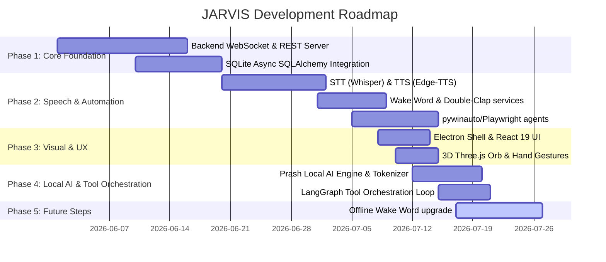

# 📋 Project Status Tracker & Roadmap

This document outlines completed milestones, items currently in development, and future roadmap enhancements.

---

## 1. Project Roadmaps & Status

---

## 2. Completed Features ✅

### 2.1. Voice & Speech System
- [x] **Wake Word Activation**: Local parsing of "Hey Jarvis" with `openwakeword`.
- [x] **Speech Synthesis (TTS)**: Natural male voices streaming over WebSocket via `edge-tts`.
- [x] **Speech Recognition (STT)**: High-speed local audio transcription via `faster-whisper`.
- [x] **Duplex Queue Handler**: Support for instant user voice interrupts.

### 2.2. Intelligent Core & Routing
- [x] **LLM Failover Router**: Auto-selection and fallbacks across Ollama ➔ Gemini ➔ Groq ➔ OpenAI ➔ OpenRouter.
- [x] **Dynamic Benchmarking**: Tracking of latency, throughput, token speed, and success metrics.
- [x] **Memory System**: Semantic knowledge search using ChromaDB and facts logging in SQLite.
- [x] **Lessons Learned Loop**: Corrective prompt injection mechanism using past errors.
- [x] **Local AI Engine (Prash)**: Headless custom transformer model trained on GPU (T4 on Google Colab) to process system intents locally.

### 2.3. Desktop & Web Controls
- [x] **GUI Control**: Window focus, application minimization, keyboard typing, cursor moving, and shortcuts using `pywinauto` and `pyautogui`.
- [x] **Web Browser Automation**: Playwright script execution to browse, fill out forms, search, and parse pages.
- [x] **Vision Reasoning**: Full display screenshot logging integrated with Gemini & GPT-4o Vision API.
- [x] **Local OCR fallback**: Text extraction from screenshots using `pytesseract`.
- [x] **LangGraph Orchestrator**: Multi-step execution loops dynamically resolving user tasks (via shell, python interpreter, and memory access).

### 2.4. HUD Interface (UI)
- [x] **3D Three.js WebGL Arc Reactor**: Procedural 3D wireframe model of the Arc Reactor (concentric rings, gear teeth, ticking LEDs, and copper coils) fully transparent and floating, with counter-rotations, central J.A.R.V.I.S. text overlay, and voice-amplitude reactor pulsing.
- [x] **Hand Gesture Tracking**: MediaPipe vision hand skeleton mapping via local webcam. Support for drag to spin and pinch to zoom.
- [x] **Siri Waveform**: Dynamic audio waveform mapping.
- [x] **Task Progress tracker**: Step-by-step checklist visualization for active agent plans.

---

## 3. In Progress 🏗️

- [ ] **Offline Wake Word Upgrade**: Custom wake phrase model generation to improve detection accuracy.
- [ ] **Active Context Preservation**: Saving open browser tab states and active window history across reboots.

---

## 4. Backlog / Future Enhancements 🔮

- [ ] **Multi-Monitor Vision**: Visual support for displaying and capturing screenshots across individual displays dynamically.
- [ ] **Calendar & Email Integration**: Direct calendar hooks and email drafts creation via voice.
- [ ] **Companion Mobile App**: Remote microphone relay to trigger desktop shortcuts and control JARVIS from a local Wi-Fi network.

