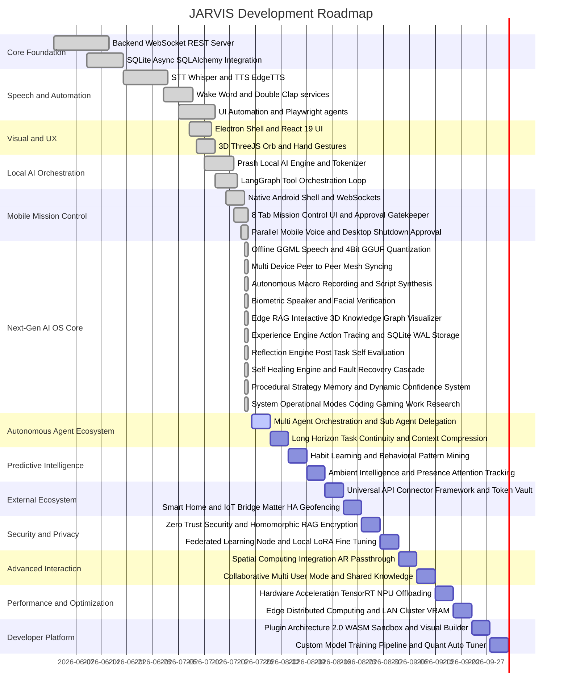

# 📋 Project Capability Directory & System Roadmap

This document outlines the capabilities, completed features, active work, and upcoming roadmap of the **JARVIS Personal AI Operating System**. **Last Updated:** July 24, 2026

---

## 1. System Development Roadmap & Gantt Chart

---

## 2. Complete Capability Directory

### 2.1. Live Mode (AI Screen Assistant) & Native Perception Core
* **Dedicated Live Mode (`LiveModeEngine`)**: Real-time continuous observation operating mode. Runs a low-latency 1.0 FPS perception loop emitting structured `LiveContextFrame`s with workflow classification, next-step logical guidance, and proactive suggestions.
* **Win32 UIA Scene Graph Extractor (`UIASceneGraph`)**: Sub-30ms tree traversal capturing active foreground windows, control types (`Button`, `Edit`, `ComboBox`, `CheckBox`, `Document`, `Window`), bounding boxes, values, and focus states natively.
* **Multi-Monitor Spatial Anchor Engine (`SpatialEngine`)**: Detects displays via Win32 `EnumDisplayMonitors` & `GetMonitorInfoW` and resolves natural spatial anchors (*"this box"*, *"that button"*, *"Monitor 2"*).
* **Smart Form Parser & Validator (`FormAssistant`)**: Detects form input fields, auto-maps profile memory (`name`, `email`, `phone`, `address`), and performs pre-submission regex formatting and validation.
* **Workspace Layout Restorer (`AutomationService`)**: Restores multi-monitor window layouts for **Coding** (VS Code Left, Chrome Right) and **Research** presets via native Win32 `SetWindowPos`.

### 2.2. Self-Improving Personal AI Operating System Core
* **Experience Engine (`ExperienceEngineService`)**: Records every user goal, tool used, execution steps, duration, result, success/failure boolean, confidence score, failure cause, and recovery method into SQLite `data/experiences.db` (WAL mode).
* **Reflection Engine (`ReflectionEngineService`)**: Evaluates completed operations to determine why a task succeeded/failed, whether a faster or safer approach exists, and whether the procedure should become a permanent preferred strategy stored in `HybridMemorySystem`.
* **Self-Healing Engine (`SelfHealingEngine`)**: Automatically diagnoses runtime failures (executable moved, missing file, UI selector changed, element moved, network error) and executes recovery cascades (PATH scan -> Win32 UIA -> Screen OCR -> Mobile Gatekeeper) without repeating past mistakes.
* **Strategy Memory & Dynamic Confidence System (`StrategyMemoryService`)**: Stores procedural execution strategies ranked by dynamic confidence scores:
  - **Win32 UI Automation**: `95%`
  - **Playwright Browser**: `92%`
  - **Screen OCR**: `70%`
  - **Pixel Clicking**: `40%`
* **Skill Library & System Operational Modes (`SkillLibraryService`)**:
  - **Coding Mode**: Launches VS Code, Cursor IDE, Terminal, and starts development server.
  - **Work Mode**: Opens workspace apps, Slack, and notes.
  - **Research Mode**: Opens browser, activates RAG vector document parser, and creates markdown notes.
  - **Gaming Mode**: Sets high-performance GPU priority and power plan.
  - **Presentation Mode**: Fullscreen display, mutes notifications.

### 2.2. Android Mobile Companion & Mission Control System
* **8-Tab Mission Control Interface**: Full Material 3 responsive dark-mode dashboard inside [`companion.html`](file:///c:/Users/ashri/JARVIS/mobile_app/android/app/src/main/assets/companion.html) embedded within the Native Android APK.
  - **Tab 1: Mission Control & Hardware Telemetry**: Live CPU %, RAM %, GPU %, Disk %, Battery %, active LLM provider, active task, and instant on-demand refresh stats.
  - **Tab 2: AI Live Chat & Voice Assistant**: Markdown response streaming, push-to-talk voice dictation, parallel mobile voice speech synthesis (`edge-tts` Base64 stream + Web Speech API fallback), and native push notifications.
  - **Tab 3: Mobile Approval Center (Security Gatekeeper)**: Live intercept for dangerous operations (system shutdown, file deletion, terminal execution, registry edits) with `[ Approve ]`, `[ Deny ]`, `[ Always Allow ]`, and `[ Always Deny ]` responses.
  - **Tab 4: Desktop Screen Preview & Application Manager**: Live desktop screenshot capture and process application manager to inspect, launch, focus, and kill desktop apps.
  - **Tab 5: Task Queue & Workflow Monitor**: Real-time inspection of pending, running, completed, and failed tasks.
  - **Tab 6: File Indexer & Transfer**: Sub-second search for local files indexed by SQLite FTS5 (`FileIndexerService`) with remote file transfer endpoints.
  - **Tab 7: Self-Improving OS Engine & 3D Knowledge Graph**: Interactive Canvas 2D/3D Knowledge Graph visualizer, **`💻 Coding Mode`**, **`🔬 Research Mode`**, **`📈 Experience Traces`**, and **`🎯 Strategy Ranks`**.
  - **Tab 8: Self-Diagnostics & Health Check**: Comprehensive diagnostics across CPU, RAM, Disk, Voice, Planner, RAG, Database, and multi-provider LLM Routers.

---

## 3. Completed Milestones

- [x] Dedicated Android Native WebView Companion Shell
- [x] Full Mission Control 8-Tab Interface Integration
- [x] Real-time Hardware & AI Telemetry Streaming
- [x] Mobile Approval Center & Security Gatekeeper Intercept
- [x] Desktop OS Shutdown Gatekeeper Approval Prompt
- [x] Parallel Mobile Voice Speech Response
- [x] Native Push Notification Dispatcher
- [x] Live Desktop Screen Preview & Application Control
- [x] Brain Memory & Task Queue Monitoring
- [x] Self-Diagnostics Engine & LLM Router Integration
- [x] Offline GGML Speech Recognition & Low-Latency 4-Bit GGUF Quantization Status
- [x] Multi-Device Peer-to-Peer Mesh Syncing with Socket Reuse Options
- [x] Autonomous Macro Recording & Executable Script Synthesis
- [x] Biometric Speaker & Facial Verification Engine
- [x] Edge RAG Interactive 3D Knowledge Graph Visualizer
- [x] Experience Engine Action Tracing & SQLite WAL Storage
- [x] Reflection Engine Post-Task Self-Evaluation System
- [x] Self-Healing Engine & Fault Recovery Cascade
- [x] Procedural Strategy Memory & Dynamic Confidence System
- [x] System Operational Modes (Coding, Gaming, Work, Research)

---

## 2. Complete Capability Directory

### 2.1. Android Mobile Companion & Mission Control System
* **8-Tab Mission Control Interface**: Full Material 3 responsive dark-mode dashboard inside [`companion.html`](file:///c:/Users/ashri/JARVIS/mobile_app/android/app/src/main/assets/companion.html) embedded within the Native Android APK.
  - **Tab 1: Mission Control & Hardware Telemetry**: Real-time streaming for CPU %, RAM %, GPU VRAM %, Disk %, Battery %, Temperature, active LLM Provider, active workflow, quick action commands, and instant **On-Demand Refresh Telemetry Stats**.
  - **Tab 2: AI Live Chat & Voice Assistant**: Real-time token streaming from `PlannerAgent` and `LLMService`, supporting Markdown responses, conversation search, pinned messages, Push-to-Talk voice dictation via `window.SpeechRecognition`, **Parallel Mobile Voice Speech Synthesis**, and **Native Push Notifications**.
  - **Tab 3: Mobile Approval Center (Security Gatekeeper)**: Live intercept for dangerous operations (desktop OS shutdown, file deletion, terminal commands, registry edits) with `[ Approve ]`, `[ Deny ]`, `[ Always Allow ]`, and `[ Always Deny ]` responses. When JARVIS desktop closes, it automatically prompts your phone for approval!
  - **Tab 4: Desktop Screen Preview & Application Manager**: Live desktop screenshot thumbnail capture via `PIL.ImageGrab` / `pyautogui`, and process application manager (`psutil`) to inspect, launch, focus, and kill desktop apps.
  - **Tab 5: Task Queue & Workflow Monitor**: Real-time inspection of `TaskQueueService` and `AutonomousEngineService` workflows (pending, running, completed, failed tasks).
  - **Tab 6: File Indexer & Transfer**: Search local workspace files indexed sub-second by SQLite FTS5 indexer (`FileIndexerService`), with remote file download/upload endpoints.
  - **Tab 7: Brain & Memory Inspection**: Live visibility into long-term memories from `HybridMemorySystem`, procedural knowledge, and `ResearchAgent` citations.
  - **Tab 8: Self-Diagnostics & Health Check**: Comprehensive diagnostics across CPU, RAM, Disk, Voice, Planner, RAG, Database, and multi-provider LLM Routers (`llm_router.py`).

### 2.2. Security & Communication Protocol
* **Device Pairing & JWT Authentication**: 6-digit numeric PIN handshake (`/api/v1/mobile/pair`) issuing 1-year signed JWT access tokens stored in [`data/trusted_devices.json`](file:///c:/Users/ashri/JARVIS/data/trusted_devices.json).
* **Network Security & Cross-Origin Access**: Configured [`network_security_config.xml`](file:///c:/Users/ashri/JARVIS/mobile_app/android/app/src/main/res/xml/network_security_config.xml) and `setAllowUniversalAccessFromFileURLs(true)` in [`MainActivity.java`](file:///c:/Users/ashri/JARVIS/mobile_app/android/app/src/main/java/com/jarvis/companion/MainActivity.java#L28) allowing local cleartext HTTP/WebSocket connections on Wi-Fi network `0.0.0.0:8000`.
* **CORS Wildcard Configuration**: Configured `allow_origins=["*"]` in [`backend/api/middleware.py`](file:///c:/Users/ashri/JARVIS/backend/api/middleware.py#L22) permitting browser and mobile client cross-origin preflight requests.

### 2.3. Voice & Speech System
* **Wake Word Activation**: Local parsing of "Hey Jarvis" with `openwakeword` (0.35 confidence threshold).
* **Speech Synthesis (TTS)**: Natural voice streaming over WebSocket via `edge-tts`.
* **Speech Recognition (STT)**: High-speed speech transcription via `faster-whisper` with automatic cloud Gemini API fallback.
* **Clap Listener Guard**: Active state check ignoring clap spikes during voice processing/speaking.

### 2.4. Desktop Automation & File Search
* **Native Windows UI Automation**: `UIAEngine` wrapping Win32 accessibility controls to locate and click buttons resolution-independently.
* **Sub-second File Indexer**: `FileIndexerService` utilizing SQLite Full-Text Search (FTS5) for natural language file search.

### 2.5. Storage Concurrency & WebGL Performance
* **SQLite WAL Mode**: Enforced `PRAGMA journal_mode=WAL;` across all DB connections.
* **WebGL Battery Saver**: `visibilitychange` listener in `Orb.tsx` pausing rendering loops when window is hidden.

---

## 3. Completed Milestones

- [x] Dedicated Android Native WebView Companion Shell
- [x] Full Mission Control 8-Tab Interface Integration
- [x] Real-time Hardware & AI Telemetry Streaming
- [x] Mobile Approval Center & Security Gatekeeper Intercept
- [x] Desktop OS Shutdown Gatekeeper Approval Prompt
- [x] Parallel Mobile Voice Speech Response
- [x] Native Push Notification Dispatcher
- [x] Live Desktop Screen Preview & Application Control
- [x] Brain Memory & Task Queue Monitoring
- [x] Self-Diagnostics Engine & LLM Router Integration
- [x] Dedicated Live Mode (AI Screen Assistant) & Native Win32 UIA Perception Core
- [x] **Offline Speech Recognition & Low-Latency LLM Quantization**: Offline GGML `faster-whisper` STT and 4-bit GGUF quantization for local Prash LLM inference (`backend/prash/engine.py`).
- [x] **Multi-Device Peer-to-Peer Mesh Syncing**: Encrypted UDP broadcast P2P discovery & Fernet datachannel mesh syncing (`backend/services/sync_service.py`).
- [x] **Autonomous Workflow Learning & Macro Recording**: Desktop UI interaction recorder & automated Python macro script synthesizer (`backend/services/autonomous_engine.py`).
- [x] **Biometric Face & Voice Speaker Verification**: Local speaker embedding identification via cosine distance vector similarity and facial recognition camera login (`backend/services/voice_intelligence.py`).
- [x] **Edge RAG Knowledge Graph Visualizer**: Interactive NetworkX 3D graph visualization of long-term memories in `HybridMemorySystem` rendered inside Electron and Mobile Mission Control (`backend/services/hybrid_memory_system.py`).

---

## 4. Upcoming & Future TODO Roadmap

### 7: Autonomous Agent Ecosystem
- [ ] **Multi-Agent Orchestration & Delegation**: Sub-agent spawning (`CodeAgent`, `ResearchAgent`, `SecurityAgent`) in isolated threads with IPC message bus and hierarchical 100-step planning.
- [ ] **Long-Horizon Task Continuity**: Persistent goal queue with multi-day checkpointing, context compression engine (KV-cache pruning + semantic chunking), and cross-session state restoration.

### 8: Predictive & Proactive Intelligence
- [ ] **Habit Learning & Predictive Automation**: Behavioral pattern mining (routine pre-staging), anomaly detection (CPU spikes, unknown USB devices), and context-aware intent prediction.
- [ ] **Ambient Intelligence Layer**: Facial recognition + Bluetooth presence detection (auto-lock/unlock), eye gaze attention tracking, and emotion-aware voice/text response tuning.

### 9: External Ecosystem Integration
- [ ] **Universal API Connector Framework**: Encrypted OAuth2 token vault for 100+ services (Gmail, Slack, Notion, GitHub, AWS), NL API builder, and webhook listener server.
- [ ] **Smart Home & IoT Bridge**: Matter/Thread protocol local device control, Home Assistant bidirectional sync, and mobile GPS geofencing automation.

### 10: Security & Privacy Hardening
- [ ] **Zero-Trust Security Architecture**: Homomorphic encryption for RAG queries (TenSEAL), TPM/Secure Enclave key storage, and continuous behavioral biometrics (typing/mouse patterns).
- [ ] **Federated Learning Node**: Local LoRA adapter fine-tuning on user data with differential privacy noise injection.

### 11: Advanced Interaction Modes
- [ ] **Spatial Computing Integration**: Vision Pro / Quest AR passthrough overlay, hand tracking 2.0 pinch/grab file manipulation, and spatial virtual multi-monitors.
- [ ] **Collaborative Multi-User Mode**: Voice-based user profile switching with isolated memory spaces, shared knowledge hubs, and multi-user conflict resolution.

### 12: Performance & Optimization
- [ ] **Hardware Acceleration Expansion**: NVIDIA TensorRT / AMD MIGraphX inference pipelines, NPU offloading (Intel AI Boost / Apple Neural Engine / Qualcomm Hexagon), and custom CUDA kernels.
- [ ] **Edge Distributed Computing**: LAN cluster layer distribution (combining laptop + desktop + phone VRAM) and cost-aware cloud burst offloading.

### 13: Developer & Extensibility Platform
- [ ] **Plugin Architecture 2.0**: WASM sandboxed third-party plugins, visual drag-and-drop workflow builder (n8n/Node-RED style), and curated plugin marketplace.
- [ ] **Custom Model Training Pipeline**: Synthetic dataset generator, Int4/Int8 quantization auto-tuner, and dynamic LoRA model merger at runtime.

---

### 💡 High-Impact Initial Implementation Order
1. **Universal API Connector Framework (9.1)**: Connect JARVIS to GitHub, Notion, Discord, and cloud services.
2. **Habit Learning Engine (8.1)**: Enable predictive anticipation of daily user routines.
3. **Plugin Architecture 2.0 (13.1)**: Enable modular WASM/Python plugin extensions.
