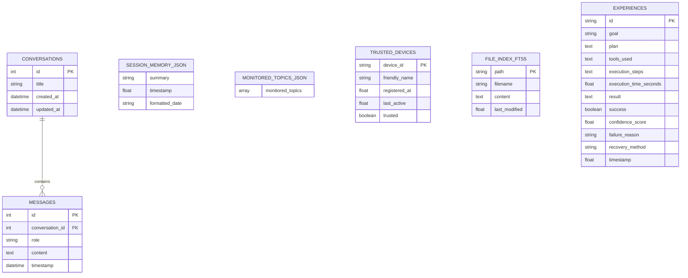

# 🗄️ Database, Mobile Schemas, Zustand Store & 3D Morph Schemas

This document provides a technical layout of relational database schemas, Zustand app store state, 3D face morph targets, and mobile data models. **Last Updated:** July 29, 2026

---

## 1. Database Table Layouts (SQLite via SQLAlchemy Async & WAL Mode)

The SQLite relational database is located at `data/jarvis.db` (enforced `PRAGMA journal_mode=WAL;`).



---

## 2. Zustand App Store State Schema (`appStore.ts`)

```typescript
interface AppState {
  assistantState: 'idle' | 'listening' | 'thinking' | 'speaking' | 'processing'
  isConnected: boolean
  messages: ConversationMessage[]
  currentTranscript: string
  isListening: boolean
  isSpeaking: boolean
  audioLevel: number // 0.0 to 1.0 (TTS amplitude level)
  currentTask: CurrentTask | null
  commandHistory: CommandEntry[]
  screenPreview: string | null
  pushToTalkActive: boolean
  is3DRotationEnabled: boolean // Toggles 360-degree Y-axis continuous rotation ON/OFF
  showSettings: boolean
  showChat: boolean
  showCommandHistory: boolean
  isWindowMaximized: boolean
  thinkingText: string
  settings: Settings
}
```

---

## 3. 3D Face Engine Morph Target & Viseme Schemas

### 3.1. Speech Viseme Weights (`VisemeWeights`)
```typescript
interface VisemeWeights {
  viseme_sil: number // Silence (0.0 to 1.0)
  viseme_PP: number  // Bilabial (p, b, m)
  viseme_FF: number  // Labiodental (f, v)
  viseme_TH: number  // Dental (th)
  viseme_DD: number  // Alveolar (d, t, n)
  viseme_kk: number  // Velar (k, g)
  viseme_aa: number  // Open Vowel (a)
  viseme_E: number   // Front Vowel (e)
  viseme_O: number   // Rounded Vowel (o)
  jawOpen: number    // Mandible Open (0.0 to 1.0)
}
```

### 3.2. FACS Morph Target Dictionary (`morphTargetDictionary`)
```json
{
  "jawOpen": 0,
  "viseme_aa": 0,
  "mouthSmile": 1,
  "eyeBlinkLeft": 2,
  "eyeBlinkRight": 2,
  "browInnerUp": 3
}
```

---

## 4. Mobile Companion Pydantic Schemas (`backend/models/mobile_schemas.py`)

### 4.1. System Telemetry (`SystemTelemetry`)
```json
{
  "timestamp": 1784732500.0,
  "cpu_percent": 14.2,
  "ram_percent": 48.5,
  "ram_used_gb": 7.76,
  "ram_total_gb": 16.0,
  "gpu_percent": 21.0,
  "battery_percent": 95.0,
  "battery_plugged": true,
  "active_task": "Command Center Listening",
  "active_workflow": "Ready",
  "active_llm_provider": "Ollama / Cloud Fallback",
  "assistant_state": "idle",
  "internet_connected": true
}
```

### 4.2. Mobile Security Approval Request (`MobileApprovalRequest`)
```json
{
  "approval_id": "appr_1784732500123",
  "action_type": "terminal_command",
  "description": "Execute: python backend/scripts/backup.py --force",
  "dangerous_target": "C:\\Users\\ashri\\JARVIS\\data",
  "timestamp": 1784732500.123,
  "timeout_seconds": 30.0
}
```
