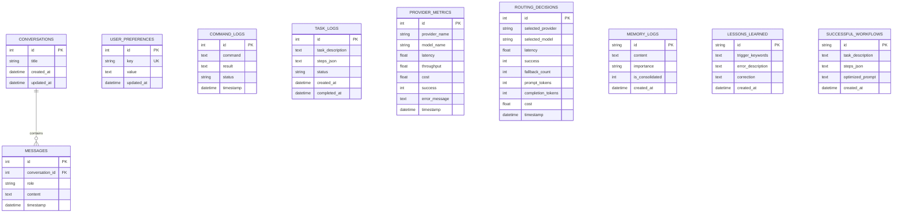

# 🗄️ Database & WebSocket Message Schemas

This document provides a comprehensive technical layout of the relational database schemas and the WebSocket message formats used for frontend-backend communication.

---

## 1. Database Table Layouts (SQLite via SQLAlchemy Async)

The SQLite database is located at `data/jarvis.db`.



### 1.1. `conversations` Table
Groups related chat messages.
* **`id`** (`Integer`, PK, Autoincrement): Unique session identifier.
* **`title`** (`String(255)`, default `"Untitled Conversation"`): Custom user-defined or LLM-summarized title.
* **`created_at`** (`DateTime(timezone=True)`): Timestamp of creation.
* **`updated_at`** (`DateTime(timezone=True)`): Timestamp of last modifications.

### 1.2. `messages` Table
Stores individual logs within conversations.
* **`id`** (`Integer`, PK, Autoincrement): Unique message identifier.
* **`conversation_id`** (`Integer`, FK to `conversations.id`): Back-linked conversation grouping.
* **`role`** (`String(20)`): Author role (`user` | `assistant` | `system` | `tool`).
* **`content`** (`Text`): Raw text/markdown content.
* **`timestamp`** (`DateTime(timezone=True)`): Timestamp of transmission.

### 1.3. `user_preferences` Table
A simple, robust key-value store for preferences.
* **`id`** (`Integer`, PK, Autoincrement): Unique identifier.
* **`key`** (`String(255)`, Unique, Indexed): Preference option key (e.g. `preferred_browser`, `voice_speed`).
* **`value`** (`Text`): Serialized configuration value.
* **`updated_at`** (`DateTime(timezone=True)`): Last modification timestamp.

### 1.4. `command_logs` Table
Audit logs of system commands executed.
* **`id`** (`Integer`, PK, Autoincrement): Unique identifier.
* **`command`** (`Text`): Shell command or path executed.
* **`result`** (`Text`, Nullable): Terminal command output.
* **`status`** (`String(20)`): Outcome status (`success` | `error` | `blocked`).
* **`timestamp`** (`DateTime(timezone=True)`): Execution timestamp.

### 1.5. `task_logs` Table
Stores history of multi-step agent plans.
* **`id`** (`Integer`, PK, Autoincrement): Unique identifier.
* **`task_description`** (`Text`): User instruction prompt.
* **`steps_json`** (`Text`, Nullable): Serialized JSON array of planned `AgentStep` dicts.
* **`status`** (`String(20)`): Overall task execution status.
* **`created_at`** (`DateTime(timezone=True)`): Time task was initiated.
* **`ended_at`** (`DateTime(timezone=True)`, Nullable): Time task execution ended.

### 1.6. `provider_metrics` Table
Benchmarks response times of active LLMs.
* **`id`** (`Integer`, PK, Autoincrement): Unique metrics ID.
* **`provider_name`** (`String(50)`): e.g. `ollama`, `gemini`, `groq`, `openai`, `openrouter`.
* **`model_name`** (`String(100)`): Specific model id (e.g. `qwen2.5-coder:3b`).
* **`latency`** (`Float`): Time to first token or response resolution.
* **`throughput`** (`Float`, Nullable): Tokens per second.
* **`cost`** (`Float`): Token execution cost (USD).
* **`success`** (`Integer`): Success flag (`1` = true, `0` = false).
* **`error_message`** (`Text`, Nullable): Stack traces or API error details.
* **`timestamp`** (`DateTime(timezone=True)`): Audit timestamp.

### 1.7. `routing_decisions` Table
Historical logs of provider selector decisions.
* **`id`** (`Integer`, PK, Autoincrement): Selector log ID.
* **`selected_provider`** (`String(50)`): Chosen provider.
* **`selected_model`** (`String(100)`): Chosen model.
* **`latency`** (`Float`): Completion latency.
* **`success`** (`Integer`): Success status.
* **`fallback_count`** (`Integer`): Number of provider attempts made before resolving the request.
* **`prompt_tokens`** (`Integer`): Input prompt token usage.
* **`completion_tokens`** (`Integer`): Output completion token usage.
* **`cost`** (`Float`): Final calculated API expense.
* **`timestamp`** (`DateTime(timezone=True)`): Selector execution time.

### 1.8. `memory_logs` Table
A lightweight cache mirroring semantic memories in ChromaDB.
* **`id`** (`String(50)`, PK): Matching vector database UUID.
* **`content`** (`Text`): Fact detail string.
* **`importance`** (`String(20)`): Priority (`low` | `medium` | `high` | `critical`).
* **`is_consolidated`** (`Integer`): Consolidated flag (`0` = false, `1` = true).
* **`created_at`** (`DateTime(timezone=True)`): Creation time.

### 1.9. `lessons_learned` Table
Mistakes corrected by the user, utilized for dynamic context prompt overrides.
* **`id`** (`String(50)`, PK): e.g. `lesson_<uuid>`.
* **`trigger_keywords`** (`Text`): Comma-separated keyword list.
* **`error_description`** (`Text`): Description of the mistake JARVIS made.
* **`correction`** (`Text`): Correction instructions for the LLM.
* **`created_at`** (`DateTime(timezone=True)`): Date logged.

### 1.10. `successful_workflows` Table
Pre-calculated execution plans that previously achieved tasks successfully.
* **`id`** (`String(50)`, PK): e.g. `workflow_<uuid>`.
* **`task_description`** (`Text`): Initial instruction description.
* **`steps_json`** (`Text`): Serialized JSON execution array.
* **`optimized_prompt`** (`Text`, Nullable): Prompt optimization keywords.
* **`created_at`** (`DateTime(timezone=True)`): Creation date.

---

## 2. WebSocket Message Envelope & Payloads

All WebSocket interactions on `/api/voice` follow a standardized Pydantic schema envelope:

### 2.1. Envelope: `WSMessage`
```json
{
  "type": "string",
  "data": {},
  "timestamp": "ISO-8601 UTC string",
  "id": "UUID-v4 string"
}
```

### 2.2. Message Types & Data Payload Fields

#### `type: "audio"` (Client ➔ Server)
Sends raw microphone audio chunks.
* **`audio_bytes`** (`bytes`): Raw binary PCM audio (16-bit, 16 kHz, mono).
* **`sample_rate`** (`int`): e.g. `16000`.
* **`channels`** (`int`): e.g. `1`.
* **`format`** (`str`): e.g. `"pcm_s16le"`.

#### `type: "transcript"` (Server ➔ Client)
STT transcription updates.
* **`text`** (`str`): Text string decoded from user speech.
* **`confidence`** (`float`): Score between `0.0` and `1.0`.
* **`is_partial`** (`bool`): `true` if interim result, `false` if finalized.
* **`language`** (`str`, Nullable): Detected language code (e.g. `"en"`).

#### `type: "tts_audio"` (Server ➔ Client)
TTS audio chunk playback streaming.
* **`audio_bytes`** (`bytes`): MP3 audio payload.
* **`format`** (`str`): `"mp3"`.
* **`is_final`** (`bool`): `true` if transmission is finished.
* **`text_segment`** (`str`, Nullable): Text portion matching this audio snippet.

#### `type: "wake_word"` (Server ➔ Client)
Wake word notification event.
* **`detected`** (`bool`): `true` when "Hey Jarvis" is identified.
* **`confidence`** (`float`): Match confidence.
* **`acknowledgement`** (`str`, Nullable): Chime greeting string (e.g. `"Yes, sir?"`).

#### `type: "response"` (Server ➔ Client)
Final text output.
* **`text`** (`str`): Completed markdown reply.
* **`is_partial`** (`bool`): Stream chunk status.
* **`conversation_id`** (`str`, Nullable): Active conversation ID.
* **`token_usage`** (`Dict[str, int]`, Nullable): `prompt_tokens`, `completion_tokens`, `total_tokens`.

#### `type: "thinking"` (Server ➔ Client)
Reasoning feedback block.
* **`text`** (`str`): Current thinking or planning thoughts.
* **`step`** (`int`, Nullable): Reasoning index.

#### `type: "status"` (Server ➔ Client)
State pipeline status updates.
* **`state`** (`AssistantState`): `idle` | `wake_word_detected` | `listening` | `processing` | `speaking` | `executing`.
* **`message`** (`str`, Nullable): Status text description.

#### `type: "agent_task"` (Server ➔ Client)
Pushes a newly built execution plan block.
* **`id`** (`str`): Unique Task UUID.
* **`description`** (`str`): Description of the goal.
* **`steps`** (`List[AgentStep]`): List of plan steps:
  * **`id`** (`str`): Step ID.
  * **`description`** (`str`): e.g. `"Browse Google for Python News"`.
  * **`tool_name`** (`str`, Nullable): Target tool.
  * **`tool_args`** (`Dict[str, Any]`, Nullable): Tool inputs.
  * **`status`** (`str`): Step execution status.
  * **`result`** (`str`, Nullable): Executed result data.
  * **`error`** (`str`, Nullable): Error string.

#### `type: "agent_progress"` (Server ➔ Client)
Real-time step updates.
* **`task_id`** (`str`): Reference Task ID.
* **`step_index`** (`int`): 0-based index.
* **`total_steps`** (`int`): Count of total steps.
* **`step_description`** (`str`): Current step description.
* **`step_status`** (`str`): Current state of execution.
* **`result`** (`str`, Nullable): Output from the tool, if finished.
* **`error`** (`str`, Nullable): Stack details on failure.

---

## 3. JSON State Storage Schemas

### 3.1. `data/paired_devices.json`
Stores paired companion desktop and mobile devices.
```json
[
  {
    "device_id": "dev_ios_01",
    "name": "Ashrit iPhone 15 Pro",
    "platform": "iOS",
    "status": "connected",
    "paired_at": 1784530000.0,
    "last_synced": 1784530500.0
  }
]
```

### 3.2. `data/user_habits.json`
Stores learned user routines and workflow pattern confidence.
```json
[
  {
    "habit": "Morning System Briefing",
    "frequency": "daily",
    "preferred_time": "09:00",
    "confidence": 0.95
  }
]
```

### 3.3. `data/long_term_goals.json`
Stores personal AI project manager milestones and long-term goal progress.
```json
[
  {
    "id": 1,
    "title": "Complete JARVIS AI OS Implementation",
    "progress_percent": 100.0,
    "status": "completed",
    "milestones": ["Vision", "Automation", "Developer", "Research", "Voice", "Productivity", "Plugins", "UI", "Observability", "Cross-Platform", "Testing", "Autonomous"]
  }
]
```
