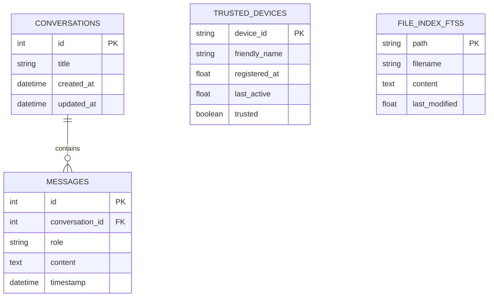

# 🗄️ Database, Mobile Schemas & WebSocket Message Protocols

This document provides a comprehensive technical layout of the relational database schemas, SQLite FTS5 virtual tables, mobile data models, and WebSocket message formats. **Last Updated:** July 22, 2026

---

## 1. Database Table Layouts (SQLite via SQLAlchemy Async & WAL Mode)

The SQLite relational database is located at `data/jarvis.db` (enforced `PRAGMA journal_mode=WAL;`).



---

## 2. Trusted Device Store Layout (`data/trusted_devices.json`)

```json
{
  "dev_android_uuid_12345": {
    "device_id": "dev_android_uuid_12345",
    "friendly_name": "Ashrit's Android Phone",
    "registered_at": 1784732000.0,
    "last_active": 1784732500.0,
    "trusted": true
  }
}
```

---

## 3. Mobile Companion Pydantic Schemas (`backend/models/mobile_schemas.py`)

### 3.1. System Telemetry (`SystemTelemetry`)
```json
{
  "timestamp": 1784732500.0,
  "cpu_percent": 14.2,
  "ram_percent": 48.5,
  "ram_used_gb": 7.76,
  "ram_total_gb": 16.0,
  "gpu_percent": 21.0,
  "battery_percent": 95.0,
  "battery_plugged": true,
  "active_task": "Command Center Listening",
  "active_workflow": "Ready",
  "active_llm_provider": "Ollama / Cloud Fallback",
  "assistant_state": "idle",
  "internet_connected": true
}
```

### 3.2. Mobile Security Approval Request (`MobileApprovalRequest`)
```json
{
  "approval_id": "appr_1784732500123",
  "action_type": "terminal_command",
  "description": "Execute: python backend/scripts/backup.py --force",
  "dangerous_target": "C:\\Users\\ashri\\JARVIS\\data",
  "timestamp": 1784732500.123,
  "timeout_seconds": 30.0
}
```

---

## 4. Mobile Companion WebSocket Stream (`/api/v1/mobile/ws/stream`)

### Telemetry Broadcast Frame (Server ➔ Mobile)
```json
{
  "type": "telemetry",
  "data": {
    "cpu_percent": 12.5,
    "ram_percent": 45.0,
    "active_task": "System Idle"
  }
}
```

### Chat Query Frame (Mobile ➔ Server)
```json
{
  "type": "chat",
  "text": "Summarize my active task queue, JARVIS."
}
```
