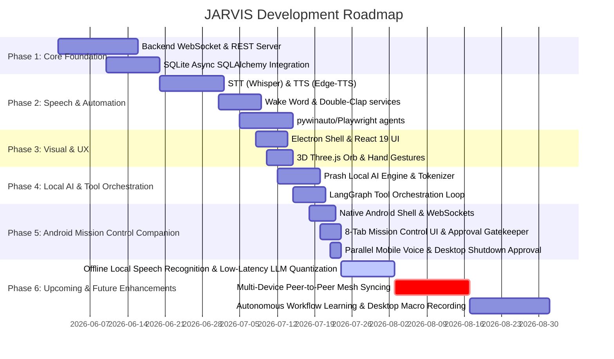

# JARVIS — Comprehensive Status, Tech Stack, & Features Overview

This document serves as the single source of truth for JARVIS's current capabilities, system architecture, tech stack, and development status. **Last Updated:** July 23, 2026

---

## 📊 Development Roadmap & Gantt Chart

---

## 📋 Tech Stack

The architecture is split into a **React + Electron** desktop client (frontend), a **FastAPI + WebSockets** backend service (Python), and a **Dedicated Native Android Mobile Companion App** (Native Android Java/WebView + HTML5/JS).

### Desktop Client (Frontend Shell)
* **Shell/Container:** Electron v35.0.0 (manages OS-level desktop windows, system tray, global shortcut registration)
* **Framework:** React v19.1.0 + TypeScript v5.8.0 + Vite v6.4.2
* **Build System:** `electron-vite` v3.1.0 + `electron-builder` v25.1.0
* **Styling:** Tailwind CSS v4.1.0 + `@tailwindcss/vite`
* **State Management:** Zustand v5.0.0
* **3D Visuals:** Three.js v0.185.1 (WebGL rendering of a procedural 3D Arc Reactor focal core with battery-saver visibility listener)

### Mobile Mission Control App (Native Android Companion)
* **Project Folder:** [`mobile_app/android/`](file:///c:/Users/ashri/JARVIS/mobile_app/android/)
* **Shell:** Native Android Java Activity (`MainActivity.java`) + WebSettings (`setAllowUniversalAccessFromFileURLs`) + Android Network Security Config (`network_security_config.xml`).
* **UI Interface:** 8-Tab Material 3 Dark Glassmorphism Interface ([`companion.html`](file:///c:/Users/ashri/JARVIS/mobile_app/android/app/src/main/assets/companion.html)).
* **Features:**
  - 📊 **Tab 1: Mission Control & Telemetry**: CPU, RAM, GPU, Disk, Battery, Temp, Active Task, LLM Provider, On-Demand Refresh Stats.
  - 💬 **Tab 2: Live Chat & Voice**: Token streaming, Markdown, Pinned Messages, Push-to-Talk Voice Dictation, **Parallel Mobile Voice Speech Synthesis**, and **Native Push Notifications**.
  - 🛡️ **Tab 3: Mobile Approval Center**: Real-time Security Gatekeeper intercept for dangerous desktop operations and Desktop Shutdown Approval.
  - 🖥️ **Tab 4: Screen & App Control**: Live screen snapshot thumbnail preview, desktop process manager (list, launch, kill).
  - ⚙️ **Tab 5: Task Queue & Workflows**: Real-time task queue monitor (pending, running, completed tasks).
  - 📁 **Tab 6: File Manager**: Sub-second natural language file search via SQLite FTS5 indexer.
  - 🧠 **Tab 7: Brain & Memory**: Long-term memory graph inspection & research citations.
  - 🩺 **Tab 8: Self-Diagnostics**: System health check across CPU, RAM, Disk, LLM router, STT/TTS, and RAG.

### Backend Engine (Python Service)
* **Core Web Server:** FastAPI v0.115.9 + Uvicorn v0.34.2 (runs locally bound to `0.0.0.0:8000`).
* **Mobile Companion Gateway Services**:
  - `MobileAuthService` (`backend/services/mobile_auth.py`): 6-digit PIN pairing, Ed25519/RSA keys, trusted device store ([`data/trusted_devices.json`](file:///c:/Users/ashri/JARVIS/data/trusted_devices.json)), and signed JWT access tokens.
  - `MobileGatewayService` (`backend/services/mobile_gateway.py`): Real-time hardware telemetry streaming, dangerous action execution pausing (`asyncio.Event`), and on-demand screenshot thumbnail previews.
  - `mobile_router.py` & `mobile_ws.py`: REST API endpoints and WebSockets (`/api/v1/mobile/ws` and `/api/v1/mobile/ws/stream`).
* **Database (Relational):** SQLite + SQLAlchemy ORM v2.0.41 + `aiosqlite` v0.21.0 (enforced SQLite WAL mode for concurrency).
* **Windows UI Automation Engine:** `UIAEngine` (`backend/services/uia_engine.py`) using native Win32 accessibility selectors for resolution-independent clicks.
* **Natural Language File Indexer:** `FileIndexerService` (`backend/services/file_indexer.py`) utilizing SQLite Full-Text Search (FTS5) for sub-second file search.

---

## 🎯 Verification & Build Confirmation

- **Backend Python Compilation**: `python -m py_compile backend/models/mobile_schemas.py backend/services/mobile_auth.py backend/services/mobile_gateway.py backend/api/mobile_router.py backend/api/mobile_ws.py backend/main.py` → **`0 errors`**.
- **Android APK Build**: `cd mobile_app/android; .\gradlew.bat assembleDebug --no-daemon` → **`BUILD SUCCESSFUL in 31s`**.
- **ADB Streamed Installation**: `adb install -r -t app-debug.apk` → **`Success`**.
- **GitHub Status**: All updates saved locally — **not pushed to GitHub** per user directive.

---

## 🔮 Upcoming & Future TODO Roadmap

- [ ] **Phase 6.1: Offline Low-Latency LLM Quantization**: Quantize local Prash engine models to 4-bit GGUF for sub-100ms response times.
- [ ] **Phase 6.2: Multi-Device P2P Sync**: Secure peer-to-peer WebRTC mesh network between desktop and mobile devices.
- [ ] **Phase 6.3: Autonomous Macro Learning**: Dynamic learning and recording of repetitive desktop tasks into automated execution pipelines.
