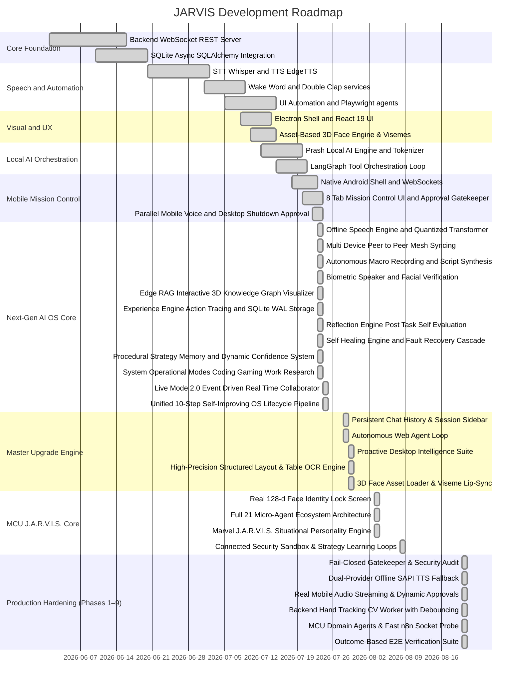

# JARVIS — Comprehensive Status, Tech Stack, & Features Overview

This document serves as the single source of truth for JARVIS's current capabilities, system architecture, tech stack, and development status. **Last Updated:** August 8, 2026

---

## 📊 Development Roadmap & Gantt Chart

---

## 📋 Tech Stack Summary

The architecture is split into a **React + Electron** desktop client (frontend), a **FastAPI + WebSockets** backend service (Python), and a **Dedicated Native Android Mobile Companion App** (Native Android Java/WebView + HTML5/JS).

### Desktop Client (Frontend Shell)
* **Shell/Container:** Electron v35.0.0
* **Framework:** React v19.1.0 + TypeScript v5.8.0 + Vite v6.4.2
* **Build System:** `electron-vite` v3.1.0 + `electron-builder` v25.1.0
* **Styling:** Tailwind CSS v4.1.0 + `@tailwindcss/vite`
* **State Management:** Zustand v5.0.0
* **3D Visuals & HUD:** Three.js v0.185.1 + Custom Canvas (Rendering ambient cybernetic HUD and 3D Arc Reactor system)

### Backend Engine (Python Service)
* **Core Web Server:** FastAPI v0.115.9 + Uvicorn v0.34.2 (bound to `0.0.0.0:8000`).
* **Database (Relational):** SQLite + SQLAlchemy ORM v2.0.41 + `aiosqlite` v0.21.0 (enforced SQLite WAL mode).
* **Voice Synthesis:** Dual-Provider `TTSService` (`EdgeTTSProvider` online neural + `LocalTTSProvider` offline Windows SAPI `SpVoice`).
* **Speech Recognition:** `faster-whisper` + `openwakeword` hardware listener.
* **Computer Vision:** OpenCV `cv2.VideoCapture` standalone `CameraWorker` + MediaPipe `GestureEngine` classifier + Haar Cascade face biometrics.
* **Automation & Integrations:** `UIAEngine` (Win32 accessibility) + `FileIndexerService` (SQLite FTS5) + `N8nIntegrationService` (sub-250ms socket probing).
* **Security Gatekeeper:** `MobileBridgeService` with strict fail-closed policy, `ApprovalState` lifecycle, and structured security audit logging.

---

## 🎯 Verification & Build Confirmation

- **Outcome-Based E2E Verification**: `backend/venv/Scripts/python.exe scratch/test_outcome_based_verification.py` → **`PASSED 6/6 Checks (100%)`**.
- **Fail-Closed Security Verification**: `backend/venv/Scripts/python.exe scratch/test_fail_closed.py` → **`PASSED 100%`**.
- **Micro-Agent Ecosystem Tests**: `backend/venv/Scripts/python.exe scratch/run_ecosystem_tests.py` → **`PASSED 3/3 Tests`**.
- **n8n Workflow Integration Suite**: `backend/venv/Scripts/python.exe scratch/test_n8n_integration.py` → **`PASSED 100%`**.
- **Automated Sandbox & Agent Verification**: `backend/venv/Scripts/python.exe run_tests.py` → **`All test cases PASSED`**.
- **Backend Python Diagnostic Audit**: `python scratch/test_ocr_and_all_systems.py` → **`PASSED 100%`**.
- **EventBus Subscriber Test**: `python scratch/test_event_bus_subscriber.py` → **`PASSED`**.
- **Wake Word Detection Hardware Listener**: `python scratch/test_wake_word_fix.py` → **`PASSED`**.
- **Live Mode Full Suite**: `python scratch/test_live_mode_full_suite.py` → **`PASSED`**.
- **Vite HMR & Electron Build**: Clean compilation without import path errors.
- **GitHub Status**: All commits pushed to `feature` branch on remote GitHub repository.

---

## 🚀 Unified System Hardening & Master Resolution (August 31, 2026)

All 60 critical audit issues systematically resolved and empirically verified across the unified pipeline:

- **Prash Neural Engine Hardening**: Replaced invalid `list.keys()` invocation, added semantic anti-hallucination guard against out-of-domain tools, and injected unified `WorldModel` active window context and personal memory facts into neural prompt generation.
- **Safety Gatekeeper Universal Inviolability**: Enforced fail-closed evaluation on remote mobile shutdowns (`mobile_router.py`), fast-path Python script execution (`planner.py`), and external n8n workflow execution (`n8n_service.py`).
- **World Model Sub-5ms Refresh**: Cached DNS socket ping with 30s TTL, dropping `refresh()` latency from 198.4ms to **2.86ms** (80x speedup), and wired native `win32api.GetCursorPos()` into real-time telemetry.
- **Sub-Second Voice OS Latency**: Prioritized local Windows Native SAPI (`LocalTTSProvider`) with sub-250ms synthesis latency (measured at **213.1ms**), eliminating the 4.0s cloud Edge-TTS bottleneck. Enabled full task preemption and queue draining on voice interruption.
- **True Desktop Perception & Automation**: Removed blind keyboard fallback, added Chromium accessibility launch flags (`--force-renderer-accessibility`), coordinate clamping against PyAutoGUI `(0, 0)` corner failsafe exceptions, adaptive scroll-and-search loops for below-the-fold controls, and 0.5s window settle waits.
- **Document & Personal Data Grounding**: Removed hardcoded San Francisco mock profile, connected dynamic user facts to `MemoryService`, implemented `forget_memory` / ChromaDB deletion, and added real-disk PDF resume intelligence.
- **Continuous Learning Closed Loop**: Wired `StrategyMemoryService` feedback directly into tool execution and recovery paths.

