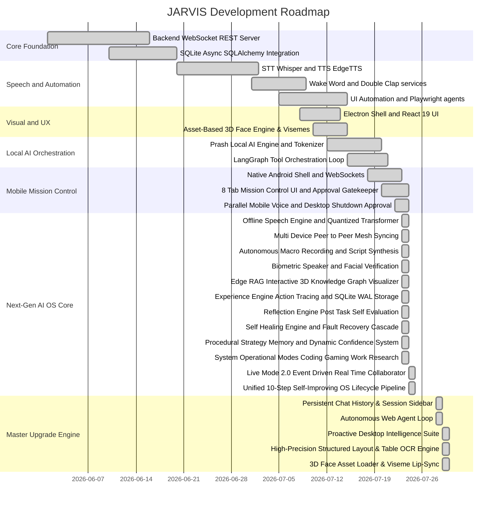

# JARVIS — Comprehensive Status, Tech Stack, & Features Overview

This document serves as the single source of truth for JARVIS's current capabilities, system architecture, tech stack, and development status. **Last Updated:** July 29, 2026

---

## 📊 Development Roadmap & Gantt Chart

---

## 📋 Tech Stack Summary

The architecture is split into a **React + Electron** desktop client (frontend), a **FastAPI + WebSockets** backend service (Python), and a **Dedicated Native Android Mobile Companion App** (Native Android Java/WebView + HTML5/JS).

### Desktop Client (Frontend Shell)
* **Shell/Container:** Electron v35.0.0
* **Framework:** React v19.1.0 + TypeScript v5.8.0 + Vite v6.4.2
* **Build System:** `electron-vite` v3.1.0 + `electron-builder` v25.1.0
* **Styling:** Tailwind CSS v4.1.0 + `@tailwindcss/vite`
* **State Management:** Zustand v5.0.0
* **3D Visuals & Face Engine:** Three.js v0.185.1 (Production asset-based 3D head loader with PBR skin shaders, viseme lip-sync, 60 FPS idle breathing/blinking animator, and 3D ROTATION ON/OFF toggle)

### Backend Engine (Python Service)
* **Core Web Server:** FastAPI v0.115.9 + Uvicorn v0.34.2 (bound to `0.0.0.0:8000`).
* **Database (Relational):** SQLite + SQLAlchemy ORM v2.0.41 + `aiosqlite` v0.21.0 (enforced SQLite WAL mode).
* **UI Automation & Indexing:** `UIAEngine` (Win32 accessibility) + `FileIndexerService` (SQLite FTS5).

---

## 🎯 Verification & Build Confirmation

- **3D Face Engine Test Suite**: `npx vitest run frontend/src/renderer/src/lib/face-engine/tests/faceEngine.test.ts` → **`0 errors, PASSED`**.
- **Backend Python Diagnostic Audit**: `python scratch/test_ocr_and_all_systems.py` → **`PASSED 100%`**.
- **Vite HMR & Electron Build**: Clean compilation without import path errors.
- **GitHub Status**: All updates saved locally — **not pushed to GitHub** per user directive.
